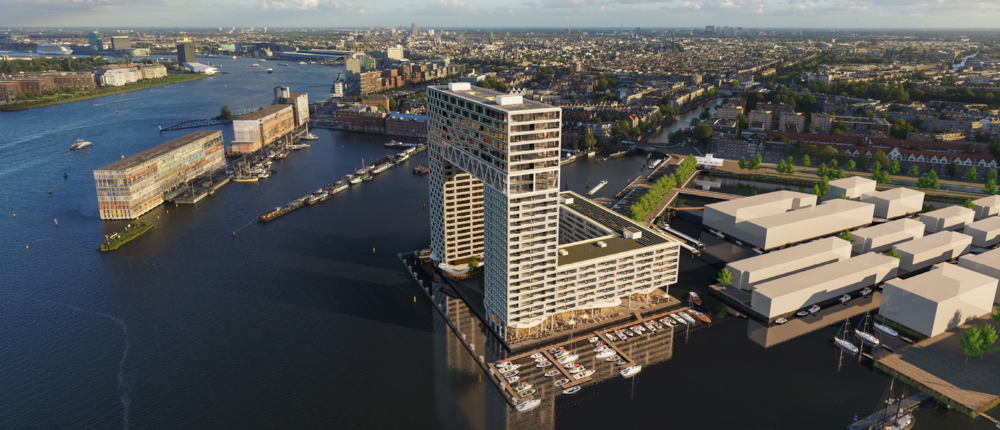

# 1. Intro

Vanaf 2018 kwam het project Pontsteiger, waar vanaf 2008 aan gewerkt was, eindelijk tot een einde \(Van Veen, 2015\). De Pontsteiger was eindelijk bewoonbaar geworden. Met de koopwoningen die gemakkelijk prijzen van een miljoen aantikken is dit gebouw exclusief voor de elite. De meest welvarende mensen hebben hun koop- of huurwoning al bemachtigd en zijn nu in 2019 bezig met verhuizen. 

Via mijn vader ben ik in contact gekomen met Jeffrey Berkouwer, de oprichter van Go In Chi\(“Goinchi”, 2018\). Jeffrey is zelf bewoner van de Pontsteiger. Doordat hij ook een bestuursfunctie vervult bij de Pontsteiger, ontdekte hij een gat in de markt. Hij kwam op het idee om een applicatie te laten ontwikkelen waarop mensen gebruik kunnen maken van diverse services die dan bij hen aan huis kunnen worden geleverd. Deze services zijn op het gebied van Health, Wealth en Happiness. Het viel Jeffrey op dat de Pontsteiger bewoners vaak drukke, hardwerkende mensen zijn die veel met hun werk geëngageerd zijn. Een vaak terugkomende overeenkomst tussen deze bewoners is ook dat ze eigenlijk meer vrije tijd zouden willen hebben om bijvoorbeeld meer tijd met hun gezin door te brengen. Zo kwam het idee van Go In Chi tot stand. Het doel van Go In Chi is om zoveel mogelijk welvarende gezinnen te ontzorgen door ze een helpende hand aan te bieden in de vorm van de services van Go In Chi. Go In Chi gelooft namelijk in het motto ‘time management is life management’. De naam Go In Chi bestaat uit drie delen, Go: word exclusief lid, In: gebruik Go In Chi als personal assistant, Chi: verbeter de kwaliteit van leven. 

De services die Go In Chi wilt aanbieden zijn externe services van afnemers die al een bedrijf hebben. Jeffrey is van plan door middel van zijn brede netwerk afnemers van verschillende services aan Go In Chi te verbinden.

Go In Chi is dus een app die exclusief voor Pontsteiger bewoners is. Jeffreys toekomstplan is om Go In Chi ook in andere luxe woningcomplexen aan te bieden. Vanwege die reden denk ik dat het belangrijk is dat Go In Chi een eigen stijl moet krijgen die niet perse alleen als onderdeel van de Pontsteiger gezien wordt.

Om de probleemsituatie duidelijker naar voren te laten komen en de opdracht voor mijzelf duidelijker te maken heb ik een design challenge geformuleerd. De design challenge die ik voor dit project aangenomen heb gaat als volgt:  
**“Hoe kan ik een exclusieve applicatie voor Go In Chi ontwerpen waarmee de bewoners van de Pontsteiger minder tijd verliezen door het boeken van diverse services?”**

Het project deel ik op in drie fases met allemaal hun eigen onderzoeksvragen. Om de onderzoeksvragen te beantwoorden zal ik een geschikte onderzoeksmethode zoeken om zo mijn vraag te kunnen beantwoorden\(“Stappen in onderzoek”, 2013\):

Fase 1: Verkenning

* Wie zijn de bewoners van de Pontsteiger?
* Hoe beleven de bewoners van de Pontsteiger de probleemsituatie momenteel?
* Wat zijn de behoeftes van de bewoners van de Pontsteiger met betrekking tot Health, Wealth en Happiness?
* Wat doen vergelijkbare concurrenten?

Fase 2: Idee ontwikkeling

* Wat voor look & feel wil ik bij het ontwerp hebben?
* Wat zijn vergelijkbare apps? Welke werken goed en welke minder goed?
* Welke patterns kunnen in de app terug komen?
* Welke onderdelen moeten terugkomen in de app?

Fase 3: Ontwerp

* Welke onderdelen werken goed in het huidige prototype? Welke juist niet?
* Wat is de ideale flow? Hoe laat ik deze terug komen in de applicatie?
* Hoe kan ik met simpele micro interacties voor little big details zorgen die de ervaring van de applicatie verbeteren?
* Hoe breng ik een exclusief gevoel bij het gebruik van de applicatie tot stand?
* Is het ontwerp technisch haalbaar?
* Letten gebruikers op de onderdelen die ik belangrijk vind, of vallen minder belangrijke onderdelen meer op?
* Is de applicatie een oplossing voor het probleem?

Deze onderzoeksvragen zal ik in de Product Biografie per doormiddel van verschillende onderzoeksmethodes beantwoorden.



Om de benodigdheid van het Go In Chi concept te onderzoeken, aan te vullen en uit te werken, zal ik ten eerste een probleemanalyse uitvoeren bij de bewoners van de Pontsteiger. Dit zal verder stapsgewijs worden toegelicht.

  

