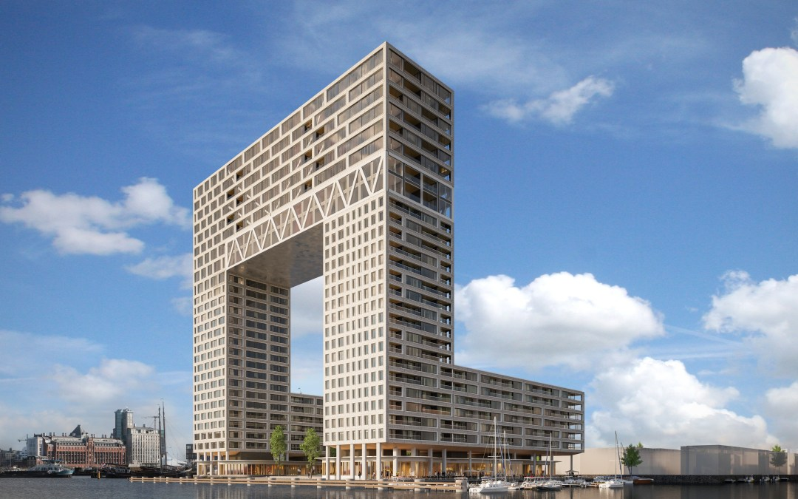
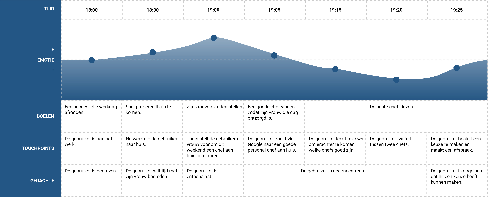
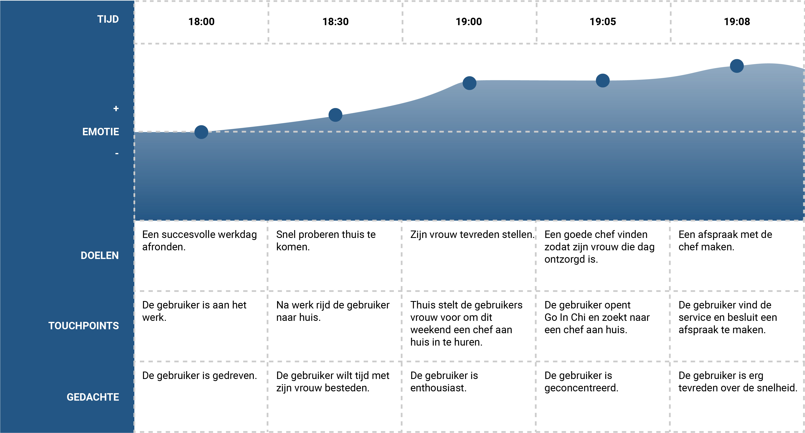

# 2. Analyse

Van Jeffrey heb ik vernomen dat het probleem waar de doelgroep mee te maken heeft is dat ze niet genoeg tijd hebben om zich te focussen op de dingen die ze belangrijk vinden, zoals hun gezin of genoeg sporten. Behalve dat zegt Jeffrey ook dat de bewoners van de Pontsteigers behoefte hebben aan wat opties voor luxueuze activiteiten.

### Wie wonen er precies in de Pontsteiger?

Omdat de applicatie voor Go In Chi exclusief is voor bewoners van de Pontsteiger is het naar mijn mening van belang dat ik mij goed in de doelgroep verdiep.

De Pontsteiger telt 66 koopwoningen en 252 huurwoningen\(“Pontsteiger woningen”, 2018\). Het gebouw is momenteel nog niet helemaal af. Daarom zijn er nu op dit moment nog weinig mensen die er echt wonen. Mijn opdrachtgever heeft ook aangegeven dat dat komt omdat voor veel bewoners dit niet hun enige woning is. Dit kan relevant zijn voor de werking van Go In Chi, omdat gebruikers dus niet altijd aanwezig zijn. De koopwoningen van 100 vierkante meter zijn vanaf 850.000 euro te koop. De woningen van 250 vierkante meter gaan zelfs vanaf de 2 miljoen euro\(“Pontsteiger verkoop”, 2018\). Dit laat direct al de welvaart van de bewoners blijken.



### Wat willen de bewoners?

Om een beter beeld van de bewoners te krijgen is het belangrijk om met zoveel mogelijk in contact te komen. Dankzij mijn opdrachtgever was het voor mij mogelijk om met verschillende Pontsteiger bewoners in gesprek te komen. Ook heb ik andere belangrijke stakeholder geïnterviewd, namelijk de afnemers van de services en de opdrachtgever. Dit word in de interviews verder toegelicht.



Ik heb met vijf Pontsteiger bewoners gesproken. Deze bewoners waren gok ik tussen de 35 en 60 jaar. 

Behalve de Pontsteiger bewoners sprak ik ook met twee andere ondernemers die niet in de Pontsteiger wonen. Ik vond vijf mensen eigenlijk net wat te weinig. Daarom heb ik er ook voor gekozen om ook nog een aantal mensen te interviewen die niet in de Pontsteiger wonen, maar die wel qua levensstijl bij de Pontsteiger zouden kunnen passen. Dit zijn mensen die financieel gezien het vermogen hebben om een woning in de Pontsteiger te kunnen kopen.

Een terugkerend probleem van de bewoners was chronisch tijdgebrek. Ze gaven eigenlijk allemaal aan dat ze graag meer tijd zouden willen hebben om zich te focussen op hun interesses. Of dat nou sport is of tijd aan het gezin besteden. Ook opvallend vind ik dat de categorieën die mijn opdrachtgever had bedacht, Health, Wealth en Happiness niet echt terug kwamen in de mening van de bewoners. Zij spraken meer over leuke en handige services. Ik denk dat de categorieën die nu gebruikt worden daarom niet helemaal op zijn plaats zijn voor Go In Chi. Om een beter beeld te krijgen wat de bewoners dan precies voor services willen heb ik een Enqûete gemaakt en die bij ongeveer 40 Pontsteiger bewoners door de brievenbus gedaan. Deze is door 11 verschillende bewoners ingevuld.



Uit de Enqûete wilde ik een eerste selectie maken uit de services die gebruikers interessant vinden voor het prototype. Dit kan mijn opdrachtgever dan ook gebruiken als hij gaat kijken welke services hij precies aan Go In Chi kan gaan verbinden. De inhoud van de enqûete heb ik samen met hem gemaakt, omdat het iets is waar hij wel al eerder overna heeft gedacht. De resultaten van de enqûete ga ik meenemen in het prototype.

### Hoe is de probleem situatie nu?

Na mijn doelgroep te hebben gesproken heb ik een algemeen beeld van de doelgroep gekregen. Door de drukke levens die de Pontsteiger bewoners hebben, blijft er weinig tijd over voor vrijetijdsbestedingen. Dit probleem geef ik hier weer in een customer journey map van de huidige situatie. Dit scenario is gebaseerd op de interviews.

#### Huidige situatie 

In de huidige situatie is het zo dat als de gebruiker een bepaalde service wil gebruiken waar hij niet heel bekend mee is. Er wordt hierdoor verwacht dat het aanzienlijk veel tijd kost om dit geregeld te krijgen. In het voorbeeld hier wilt de gebruiker een personal chef aan huis boeken. Dit is iets dat de gebruiker nog niet eerder heeft gedaan, waardoor het behoorlijk wat tijd kost om dit voor elkaar te krijgen. Er wordt voorspeld dat er weinig animo is, onder andere door tijdgebrek voor het onderzoeken of een bepaalde dienst van goede kwaliteit is. Als Go In Chi in het leven van de gebruiker zou zijn, zou de situatie heel anders zijn.

#### Met Go In Chi

Als de gebruiker Go In Chi tot zijn beschikking heeft zal de situatie er waarschijnlijk anders uitzien. De stap naar het onbekende verdwijnt namelijk helemaal. De gebruiker weet waar hij naartoe kan om zijn doel te bereiken. Dat zorgt dat de dip bij emotie nu juist een stijging is. Hierdoor eindigt de gebruiker met een prettiger gevoel dan als hij de situatie zonder Go In Chi benadert. Behalve dat is de gebruiker volgens deze customer journey map maarliefst 17 minuten eerder klaar. 

Er is natuurlijk nog geen onderzoek gedaan naar hoe snel Go In Chi zal werken aangezien de app nog helemaal niet bestaat. De 17 minuten is dus ook slechts een speculatie. Het is echter wel een doel van mij dat gebruikers binnen een paar minuten en service kunnen boeken, vandaar dat ik het hier in de customer journey map heb laten terug komen.



### Job Stories

Om de probleemsituatie duidelijk te framen heb ik besloten om job stories te gebruiken. Deze zijn namelijk erg handig om een oorzakelijk verband gestructureerd en duidelijk weer te geven\(Klement, 2013\), gebruik ik de format "als ik... wil ik... zodat ik...". Dit format zorgt ervoor dat de motivaties van de Pontsteiger bewoners goed in kaart worden gebracht,  waardoor oplossingen gemakkelijk bedacht kunnen worden. In de tabel hieroner stel ik de drie vragen elk in een apparte kolom. Deze kunnen van links naar rechts gelezen worden. De informatie in de job stories zijn gebaseerd op de interviews die ik eerder heb afgelegd.

| Als ik... | wil ik | zodat ik |
| :--- | :--- | :--- |
| uit mijn werk kom, | het liefst tijd met mijn gezin besteden | de rest van de avond niet meer aan werk hoef te denken. |
| weekend heb, | het liefst niet bezig zijn met werk | leuke dingen kan doen met mijn echtgenoot. |
| weekend heb, | geen klusjes hoeven doen | tijd heb om leuke dingen te doen, zoals beauty dingen. |
| een drukke dag heb gehad, | iemand hebben die mijn klusjes kan doen | meer vrije tijd heb. |
| gebruik wil maken van een nieuwe dienst, | niet veel tijd kwijt zijn om uit te zoeken wat de beste is | niet mijn vrije tijd hieraan kwijt ben. |
| gebruik wil maken van een nieuwe dienst, | de garantie hebben dat dit een goede service is | niet helemaal moet onderzoeken wat het beste voor mij is. |
| aan mijn werk denk, | wil ik altijd vernieuwen en verbeteren | meer klanten kan krijgen. |



