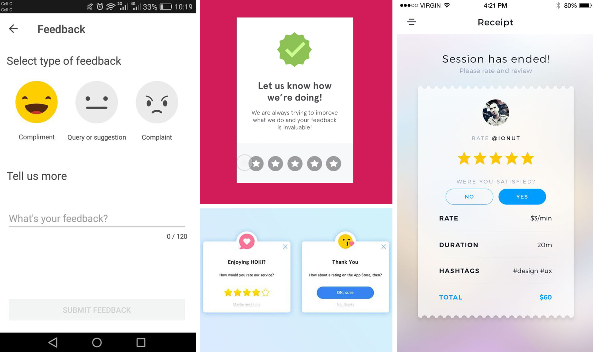

# 3. Onderzoek en Conceptvorming

## Content Onderzoek

### Eisen van de opdrachtgever

Om beter de visie van de opdrachtgever te begrijpen ben ik natuurlijk met hem in gesprek gegaan om te kijken wat hij belangrijk. Dit interview kan terug gelezen worden in mijn product biografie.



Mijn opdrachtgever vind het belangrijk dat Go In Chi niet zomaar services aanbied, maar alleen maar services met boven gemiddelde kwaliteit. Daarom lijkt het hem slim om gebruik te maken van reviews. Gebruikers kunnen voor elke afspraak die ze hebben gehad een beoordeling achter laten door een keuze te maken tussen de één en vijf sterren. Services die te vaak onder vier sterren scoren zullen niet meer worden aangeboden.

### Vergelijkbare concurrenten

Om tot een goed concept te komen ben ik eerst op zoek gegaan naar bestaande services die soortgelijke dingen doen. Ik stelde mijzelf de vraag: wat doen vergelijkbare concurrenten?

Ik kon niet echt een concurrent vinden die echt hetzelfde idee heeft als Go In Chi, dus ik ben op zoek gegaan naar services die alleen in bepaalde opzichten overeen komen. Een goed voorbeeld hiervan is SoHo House. Dit is een privé members club voor mensen in de creatieve industrie. SoHo House biedt hen verschillende locaties om te werken, eten en overnachten. De exclusiviteit die SoHo House heeft vind ik sterk naar voren komen. Ze geven je een sterk gevoel dat je er ook een onderdeel van wilt zijn. Dit doen ze op hun website door te laten zien dat ze alleen het beste van het beste aanbieden en aan te geven dat het alleen voor de elite is. 

Een andere interessante service waar ik op ben gekomen is MINDBODY. De overeenkomsten met Go In Chi zijn eigenlijk tegenovergesteld van de overeenkomsten met SoHo House. MINDBODY biedt services aan op gebied van Health. Het is alleen niet exclusief, maar juist voor iedereen toegankelijk. Ik denk dat er voor Go In Chi gekeken moet worden naar de manier van aanbieden zoals MINDBODY dat doet, maar meer in de vorm van SoHo House.

Een laatste interessante service waar ik op uitkwam was Booking Experts. Deze vond ik juist interessant op technisch gebied. Booking Experts is net als Go In Chi een verzamelpunt voor verschillende onderdelen. Bij hun is dit op gebied van vakantieparken, hotels en andere verhuurorganisaties. Als je dus bijvoorbeeld iets verhuurt op Airbnb en Booking.com brengt Booking Experts dit samen op één platform. Go In Chi moet dit ook doen voor de gebruikers met de verschillende services die zij aanbieden. Go In Chi moet een verzameling laten zien van verschillende services die eigenlijk niet onder één bedrijf vallen. De links die Go In Chi legt moeten achter de schermen gebeuren en voor de gebruikers niet te merken zijn.

Wat mij ook opviel is dat de at home service die Go In Chi wilt aanbieden echt een niche is en zeker in de applicatie moet voorkomen.



### 

### Applicatie

Uit de interviews die ik heb gedaan kon ik wel halen dat de doelgroep erg veel gebruik maakt van de mobiele telefoon en niet zo zeer van laptops of computers. Daarom denk ik dat het slim is om een applicatie te bouwen en niet een website. Een groot voordeel is dan ook dat Go In Chi gebruik kan maken van pushberichten, wat bij een website niet mogelijk is\(Apps ontwikkelaars, 2015\). Ook geeft een applicatie meer vrijheid omdat het niet via een browser getoond wordt waar misschien net die bepaalde animatie niet goed werkt. Ik ben van plan animaties in de vorm van micro interacties terug te laten komen, dus dit is zeker een nadeel.

### Health, Wealth en Happiness?

Mijn opdrachtgever had de services van Go In Chi opgedeeld in de categorieën Health, Wealth en Happiness. Echter bleek uit mijn interviews dat dit niet echt aansloeg op de doelgroep. Daarom heb ik besloten om een Card Sorting te doen met een aantal andere CMD'ers en ex CMD'ers. Door het drukke tijdschema van de Pontsteiger bewoners was het helaas niet haalbaar om met mijn doelgroep de brainstormsessie te organiseren. Echter kwam de vakkundige kennis van de CMD'ers goed van pas. Deze groep studenten bestond uit één eerste jaars CMD'er, één derde jaars CMD'er en twee afgestudeerde CMD'ers. Van CMD'ers verwacht ik dat er veel creatieve inbreng is vanwege het feit dat we allemaal ervaring hebben opgedaan tijdens onze studieloopbaan met dit soort onderzoek. Tijdens de Card Sorting hebben we de services die op de enqûete stonden uitgeschreven en deze in verschillende categorieën geprobeerd te stoppen. Wat ons uiteindelijk de beste verdeling lijkt is Health, Lifestyle, Business en Assistance. De andere categorieën kwamen namelijk minder goed uit met de services waar wij mee werkten. In mijn product biografie staat een uitgebreider overzicht van de andere categorieën die wij overwogen.



## Interactie/usability

### Patterns

Om een goede applicatie te maken is het van belang om goed te kijken hoe bepaalde functies het beste tot hun recht komen. Zo is het van belang om gebruik te maken van vaak voorkomende patronen, omdat de bekendheid bevorderend is voor de user experience. Gebruikers die de applicatie nog nooit gebruikt hebben kunnen op die manier toch bekend zijn met de elementen die erin voorkomen. \(Tidwell, 2010\)

#### Home

Op de homepagina wil ik een samenvattend overzicht geven van wat de app te bieden heeft. Hierin wil ik doorlinken naar de belangrijkste onderdelen zoals het gebruiken van de services die Go In Chi aanbiedt. Ook lijkt dit mij een goede plek om nieuws binnen Go In Chi te laten zien. Als Go In Chi een nieuwe service toevoegt, kan dit hier laten zien worden. 

#### Carrousel

Het nieuws kan worden weergegeven in een carousel. Dit is een overzichtelijke manier om meerdere nieuwsberichten te tonen zonder ze allemaal in een lijst te plaatsen\(“Carrousel - Interaction Design Pattern Library - Welie.com”, 2007\). Dit zorgt ook dat de aandacht van de gebruiker meer de focus heeft op één nieuwsbericht tegelijk\(“Carousel design pattern”, 2008\).

#### Services

Het hoofddoel van het platform is het boeken van de verschillende services die Go In Chi aanbiedt. Daarom is het belangrijk dat dit proces voor de doelgroep makkelijk te voltooien is. De benodigde informatie zal per service verschillend zijn. Toch zal het zo zijn dat bepaalde elementen vaker terug komen, zoals het kiezen van een datum en tijd of het selecteren uit meerdere opties.

#### Datum

Om de gebruiker een datum te laten selecteren lijkt het mij het beste om gebruik te maken van een kalender. Dit geeft gebruikers de optie om een daadwerkelijke datum te selecteren wat tot minder fouten zal leiden dan als de gebruikers dit bijvoorbeeld zelf zouden moeten typen\(“Calendar Picker design pattern”, 2008\).

#### Tijd

Datum en tijd gaan bij het maken van een afspraak hand in hand. Dat komt omdat de beschikbare tijden per datum zullen verschillen omdat er misschien andere werktijden zijn of bepaalde tijden al bezet zijn. Daarom is het belangrijk de tijd gelijk na de datum weer te geven. 

Een andere interessante pattern is het beperkt houden van de tijd opties. Daarmee wordt bedoeld dat alleen beschikbare tijden weergegeven worden. Als een service bijvoorbeeld op een dag drie verschillende tijden aanbiedt, namelijk om 1 uur, 2 uur en 3 uur, maar 2 uur al bezet is, wordt deze optie niet meer weergegeven. De gebruiker krijgt dus alleen de opties 1 uur en 3 uur te zien. Hierdoor is het voor de gebruiker makkelijker om te kiezen en is er minder ruimte om fouten te maken\(“Limited choice design pattern”, 2008\).

#### Thumbnails

Om gebruikers meer context bij een service te geven zou ik in het overzicht van de verschillende services gebruik willen maken van thumbnails. Door thumbnails toe te voegen kunnen gebruikers sneller door een overzicht heen browsen en bij de services gelijk een idee krijgen wat de service precies inhoudt\(“Limited choice design pattern”, 2008\). In het beste scenario snapt de gebruiker zonder te lezen al gelijk wat er aangeboden wordt. Thumbnails worden heel erg veel gebruikt bij allerlei soorten websites en apps. Daarom is dit een pattern waar gebruikers al bekend mee zullen zijn waardoor hun user experience bevorderd wordt.

### 

#### Reviews

Jeffrey wilt voor Go In Chi gebruik maken van een rating systeem. Dit wil hij doen omdat hij het van belang vindt dat Go In Chi alleen de beste services aanbiedt. Om gebruikers aan te sporen om deze reviews ook achter te laten zou het nuttig kunnen zijn dat er gebruik wordt gemaakt van een simpel systeem waar gebruikers al bekend mee zijn.

#### Rating

Door middel van een rating systeem kan Go In Chi een garantie geven dat de services die zij aanbiedt, altijd van hoge kwaliteit zijn\(“Rating - Interaction Design Pattern Library - Welie.com”, 2007\). De twee meest gebruikte rating systemen zijn ratings door middel van sterren of door middel van een like/dislike. Door het sterren systeem te gebruiken zouden gebruikers  duidelijk aan kunnen geven wat ze precies vonden van de ervaring en kan Go In Chi bepalen of een service goed genoeg is om aan te bieden. Services die onder de 4 sterren scoren voldoen niet aan de eisen. Er kan dan vervolgens gekozen worden om de service niet meer aan te bieden.

#### Buttons

Alle websites en apps bevatten links die door de makers toegevoegd zijn met het doel dat de gebruikers deze zo vaak mogelijk aanklikken. Sommigen zijn belangrijker dan andere. De belangrijkste links kunnen worden weergegeven als een button\(“Action Button - Interaction Design Pattern Library - Welie.com”, 2007\). Om buttons onderling van elkaar te kunnen onderscheiden in hiërarchie kunnen verschillende aanpassingen worden gemaakt. Hierbij kan bijvoorbeeld gedacht worden aan kleur, formaat en hoeveel wit ruimte er om de button heen is.



### 

### A**f**spraak maken

Aangezien Go In Chi in bepaalde mate een bookingapp is, is het maken van een afspraak eigenlijk het hoofddoel van de hele app. Daarom is het van zeer groot belang dat deze stap zo efficiënt mogelijk werkt en dus een optimale gebruiksvriendelijkheid verschaft aan de gebruikers.  

Er kan gebruik gemaakt worden van een kalender, zodat gebruikers op die manier de datum van hun afspraak kunnen selecteren. Echter is dit zeer ineffectief vanwege de volgende punten:

* Bijna geen één service zal elke dag beschikbaar zijn. De meeste zullen een dag of drie per week beschikbaar zijn, dus verliest de halve agenda hierdoor haar functie. 
* Een maand is voor de meeste services al erg ver vooruit. Het komt zeer zelden voor dat men een afspraak, bijvoorbeeld bij de fysiotherapeut, een maand vooruit maakt, aldus de fysiotherapeut van Go In Chi. Daarnaast is het voor de afnemers niet handig, omdat ze zo ver van te voren hun beschikbaarheid al moeten weten en opgeven. Immers is niet iedereen in staat om vroeg van tevoren van een optimale timemanagement gebruik te maken en dit door te voeren. 

Vanwege deze redenen ben ik op zoek gegaan naar andere oplossingen voor het kiezen van een datum. Zo wordt in onderzoek van Friedman \(2017\) aangeraden om een kalender toe te voegen die ontworpen is aan de hand van de functie en gebruik van de specifieke app. Daarmee wordt bedoeld dat de vorm van de datum moet aanpassen op de functie die deze heeft. Omdat de vraag van Pontsteiger bewoners vooral op korte termijn is, volstaat een kalender voor meerdere maanden in dit geval niet. Na het spreken van een aantal afnemers concludeer ik dat gebruikers maximaal een maand vooruit moeten kunnen plannen, en ongeveer drie dagen per week een afspraak moeten kunnen maken.



Als een afspraak dus maar op drie dagen in de week kan en er maar vier weken vooruit gepland hoeft te worden, zijn dat dus 12 opties waarop een gebruiker een afspraak kan maken, wat vrij weinig is. Om die redenen ben ik uiteindelijk op een datum slider uitgekomen. Andere overwegingen waren om de datums in blokken te plaatsen zoals dat met de tijd ook is gedaan of om een dropdown te gebruiken. Bij de blokken denk ik alleen dat er overbodig veel ruimte wordt gebruikt. De dropdown aan de andere kant heeft weer als probleem dat gebruikers altijd twee keer moeten klikken om hun doel te bereiken, terwijl dit bij de slider met slechts één klik zou kunnen. Met behulp van de slider kunnen gebruikers snel een overzicht van alle datums waarnemen, zonder dat dit onnodig veel ruimte inneemt, zoals de kalender dat voorheen wel deed. Ook wordt zo minder ruimte overgelaten voor errors, omdat alle opties simpelweg geselecteerd kunnen worden.  

Verder zijn de tijden gekoppeld aan de datum. Zo krijgt de gebruiker nieuwe tijden te zien na het selecteren van een nieuwe datum. De tijden zullen veranderen met een responsive disclosure wat inhoudt dat bepaalde content pas zichtbaar is na het maken van een bepaalde selectie. Dit is een goede manier om nieuwe, gelinkte elementen aan de gebruiker te tonen. \(Tidwell, 2005\) Zo worden tijden die al volgeboekt zijn niet meer getoond, omdat dat alleen maar tot verwarring kan leiden. \(Friedman, 2017\). Ook kunnen gelinkte vragen bij elkaar gehouden worden op een pagina zonder deze te vol en complex te maken \(Tidwell, 2010\). De volgende stap is gelijk duidelijk voor de gebruiker.Als de gebruiker zijn Google Agenda gelinkt heeft met Go In Chi zullen de tijden waarop de gebruiker al een andere afspraak heeft staan, anders worden weergegeven om deze overlap te tonen. Als de gebruiker ervoor kiest om toch voor deze tijden te gaan, zal er nog een waarschuwing in beeld verschijnen.  

Na mijn tweede prototype te hebben getest met een aantal afnemers heb ik nog nieuwe eisen ontdekt waar aandacht aan besteed kan worden. Bij veel services word je persoonlijk geholpen door de afnemer. Daarom is het van belang dat de afnemers, als het ware, een band krijgen met de gebruikers. Om die reden is het ook van belang dat de gebruiker kan aangeven met wie hij de afspraak wil maken als er meerdere werknemers actief zijn bij één service. Ook kan het handig zijn om van te voren te weten waar de persoon een afspraak voor maakt. Deze informatie zou toch handig kunnen zijn voor de afnemers die hier rekening mee kunnen houden.   

Een andere optie die valt te overwegen is het maken van meerdere afspraken. Wellicht willen gebruikers wel in een keer meerdere afspraken maken. Echter zou het onhandig zijn als de gebruiker meerdere keren het proces opnieuw zou moeten doorlopen. Daarom heb ik de optie toegevoegd om tegelijkertijd nog een afspraak toe te kunnen voegen. Wanneer van deze optie gebruik wordt gemaakt,  hoeft de gebruiker niet alle gegevens opnieuw in te vullen. De vraag naar de klachten en andere opmerkingen wordt als geheel gebruikt voor alle afspraken die op dat moment gemaakt worden, omdat de kans minimaal wordt geschat dat deze zullen verschillen.   

Tot slot veronderstel ik dat  de mogelijkheid om een opmerking te plaatsen bij het maken van een afspraak bij kan dragen aan de optimale user experience. Het is een kleine extra die de gebruiker  niet verplicht hoeft in te vullen, maar wel mogelijk is wanneer de gebruiker toch nuttige informatie kwijt wil. Ook heb ik de optie toegevoegd om een locatie te selecteren voor de afspraak. Er wordt verondersteld dat de meeste bewoners de services aan huis willen hebben om zo tijd te besparen, maar er wordt ook verwacht dat enkele bewoners daar geen behoefte aan zullen hebben. Voor hen is er nog de optie om het op de locatie van de service te krijgen.

#### Benchmark

Hier kan een afspraak gemaakt worden door een tijdslot te selecteren dat nog open staat. Dit is een interessante manier om gebruikers een keuze te laten maken. Het nadeel dat ik hier wel in zie is dat er een mogelijkheid is dat de gebruiker heel veel datums en tijden te zien krijgt die niet toegankelijk zijn. Hiermee wordt namelijk de kans op fouten groter, wat voor gebruikers nooit prettig is.

Het linkerscherm geeft een herkenbaar overzicht van datum en tijd weer. Er wordt verondersteld dat men bekend is met de vaak voorkomende kalender. De knoppen met tijden zijn ook gemakkelijk om te begrijpen en te gebruiken . Dit duidt op een goede gebruiksvriendelijkheid. 

Het rechterscherm is interessant voor services met ingewikkeldere stappen. Bij een vraag met meerdere opties wordt gebruik gemaakt van een dropdown menu. De gebruiksvriendelijkheid wordt bevorderd omdat de opties zo minimale ruimte in beslag nemen en het overzicht goed bewaren. Bij datums wordt gebruik gemaakt van een slider die wederom ervoor zorgt dat minimale ruimte in beslag wordt genomen. Een kalender hier zou de pagina een stuk voller maken. De dagen worden weer mooi als knoppen weergegeven.Tot slot is het nog opmerkelijk dat bij de "Book Now" knop onderaan de prijs wordt weergegeven om gebruikers duidelijk te laten weten wat ze zullen uitgeven. Dit zou met name interessant kunnen zijn als een service een variërende prijs heeft.

In dit voorbeeld wordt een duidelijke bevestiging gegeven dat een gebruiker een afspraak heeft gemaakt. Dit is goede feedback voor de gebruiker, omdat het duidelijk is wat er is gebeurt. Deze melding wijst daarna door naar de agenda.



  

### Agenda

Een aanmerkelijk onderdeel van de Go In Chi app is de agenda. Dit kan verklaard worden door het belang van een duidelijk afspraken overzicht voor de gebruikers. Immers is structuur cruciaal voor de gebruiksvriendelijkheid \(Bos, z.d.\)

Voor de realisatie van het concept Go In Chi is het van belang om ten eerste goed in te zien wat mijn verwachtingen zijn omtrent het agenda gebruik van de Pontsteiger bewoners. Uit diverse interviews met de doelgroep is vastgesteld dat deze bewoners een druk leven leiden, resulterend in overvolle agenda’s. Deze bevinding veronderstelt dat de agenda in Go In Chi niet met het doel gemaakt moet worden om de huidige agenda app van de gebruiker te vervangen. Immers zal de agenda vervanging niet de bewoners kunnen ontlasten bij hun timemanagement. De Go In Chi agenda moet zich wel focussen op de afspraken die gemaakt zijn met de services binnen de app. De gebruikers zouden ook in hun huidige agenda kunnen kijken om vooruit te plannen voor de Go In Chi afspraken \("Calendar API, Google Developers", z.d.\). Uit de interviews met de gebruikers is ook gebleken dat ze vooral in de Go In Chi app kijken met het doel om meer informatie over de afspraak te vergaren. Zo zouden ze terug kunnen kijken met wie ze precies de afspraak hebben, welke bijzonderheden er aangegeven staan over de service en de mogelijkheid om de afspraak te kunnen annuleren. Er wordt verondersteld dat de gebruikers een minimale behoefte zullen hebben aan ver vooruit kijken naar de toekomst bij de hantering van de applicatie. Zo kwam in mijn afgelegde interviews met de afnemers naar voren dat hun cliënten vaak maar een week vooruit plannen. Dit is de reden voor mijn keuze om de agenda weer te geven in een dagoverzicht en dus niet in een week- of maandoverzicht.

#### Benchmark

In deze agenda krijgt de gebruiker de optie om de agenda weer te geven op dag, week en maand. Dit geeft de gebruiker de mogelijkheid om zijn of haar eigen voorkeur te gebruiken. De grote titel daaronder geeft groot de datum en dag weer zodat er geen verwarring kan ontstaan. Aan de rechterkant wordt een social media timeline weergegeven die met de datum te maken lijkt te hebben. In dit voorbeeld is het lastiger om te begrijpen hoe het precies werkt zonder de context, maar het overzicht aan de linkerkant biedt wel een volledige weergave, omdat het minimaal is maar toch alle nodige informatie geeft.

Het linkerscherm is interessant om de volgende redenen die in dit stuk besproken worden. Ten eerste wordt de dag bovenaan weergegeven in een slider die uit afkortingen bestaat. Hierdoor nemen de dagen maar weinig ruimte in beslag en kan er een hele week op worden weergegeven. De maand en het jaar worden er ook los boven weergegeven, zodat de datum van de dag in slechts twee getallen kan worden weergegeven. Daaronder wordt de agenda in een timeline weergegeven. Hierdoor zijn er geen lege ruimtes in de agenda als de gebruiker op dat moment er niks op heeft staan. Onderaan staat een grote knop die erg opvalt door de kleur die hij heeft. Deze knop heeft alleen een plusje erop, wat een indicatie is voor een knop om iets toe te voegen.

Rechts zien we een een ander soort timeline. Deze geeft afspraken weer in blokken onder elkaar. Dit is is duidelijker dan het linkerscherm als de gebruiker meerdere afspraken tegelijk heeft lopen. Dit zou bij Go In Chi niet van toepassing kunnen zijn omdat de gebruiker over het algemeen niet meerdere services tegelijk kan gebruiken. Het zou in sommige gevallen wel kunnen, maar het is niet de normale situatie.

Bij deze laatste twee schermen is te zien dat in het linker scherm een teaser van de agenda wordt weergegeven. De eerstkomende afspraak wordt in een groot formaat weergegeven. Dit kan handig zijn als een gebruiker voor de afspraak nog even snel de gegevens wil controleren. 

In het rechterscherm is de agenda als geheel te zien. De dagen zijn ieder in een eigen blok weergegeven. Dit geeft een duidelijk onderscheid tussen de afspraken.



### Micro Interacties

Micro interacties hebben de afgelopen jaren het verschil gemaakt met het design van goed werkende apps en websites\(Tuk, 2016\). Als je terug kijkt naar oudere apps waar micro interacties nog geen ding waren is het veel moeilijker om te volgen wat er allemaal precies gebeurt. Micro interacties kunnen de gebruiker helpen om beter te begrijpen hoe de app of website navigeert, maar is tegelijkertijd ook een aanmoediging om met de site of app te interacteren\(Batchu, 2018\). Behalve dat laat het zien dat er aandacht voor detail was bij het maken van het ontwerp, wat van belang is op de luxe markt\(Batchu, 2018\).

De interessantste micro interacties vind ik de swipe, animaties en micro interacties bij data input. Deze vind ik belangrijk om uiteindelijk bij Go In Chi terug te zien omdat deze gebruikers een hoop duidelijk kunnen geven over de werking van de app. Als bijvoorbeeld een afspraak gemaakt wordt en de gebruiker deze na afloop richting de agenda ziet animeren geeft dit nog extra duidelijkheid dat het dus gelukt is om de afspraak toe te voegen. Meer hierover is te lezen in mijn product biografie.



## Vormgeving

### Look & Feel

Go In Chi is een platform die is bedoeld voor de Pontsteiger bewoners. Eerder tijdens het doen van Desk Research heb ik al geconcludeerd dat deze mensen erg welvarend zijn en aangezien ze in de Pontsteiger wonen duidelijk niet vies zijn van wat luxe. Dit is belangrijk om ook in het ontwerp van Go In Chi mee te nemen omdat het de doelgroep natuurlijk moet aanspreken. 

Veel luxueuze apps zoals in het voorbeeld hierboven maken gebruik van vrij veel witruimte en laten de belangrijke content daardoor goed naar voren komen. Dit straalt veel rust uit. Door alleen de belangrijke onderdelen te laten zien worden zo ook misverstanden vermeden.

Een andere afweging die ik heb gemaakt is om te kijken naar de huisstijl van de Pontsteiger. Toch heb ik besloten om dit niet te doen. Dat heeft te maken met het toekomstplan van Go In Chi. Als het concept aanslaat in de Pontsteiger wilt mijn opdrachtgever deze ook in andere luxe appartementen complexen gaan aanbieden. Het is dus wel van belang dat Go In Chi een opzichzelf staand product is en niet iets dat alleen bij de Pontsteiger zou passen.

### Kleur

Het eerste wat mij opvalt als ik kijk naar het design van een luxueuze app is de kleur. De grote hoeveelheid van deze designs bestaan uit de combinatie van zwart en goud. Goud geeft een gevoel van prestige en rijkdom\(Rikard, 2018\). Binnen sport/competities is goud ook de kleur die wij associëren met de nummer 1, waardoor goud het gevoel geeft alsof het het beste van het beste is. Deze kleur wordt denk ik zo vaak met zwart gecombineerd omdat de twee kleuren een magnifiek contrast hebben met elkaar. Deze kleurcombinatie wil ik daarom laten terug komen bij Go In Chi.

### 

### Typografie

Een ander onderdeel dat snel mijn aandacht trekt is het typografie. Het valt mij op dat de luxe applicaties altijd gebruik maken van duidelijk leesbare fonts en dat de tekst vrij veel ruimte krijgt. De teksten bestaan vrijwel altijd uit schreefloze letters. Ik denk persoonlijk dat deze over het algemeen ook leesbaarder zijn dan letters met schreef. Voor de titels zie ik dat beiden regelmatig voorkomen. Voor digitale ontwerpen vind ik zelf dat een schreefloze letter beter tot zijn recht komt\(Bear, 2019\).

### Best Practices

Andere voorbeelden van bestaande apps die wat mij betreft inspirerend zijn voor Go In Chi zijn Luxy\(“Luxy - Millionaire Dating”, 2012\), Minibar Delivery\(“‎Minibar Delivery”, 2013\) en JetSmarter\(“‎XO powered by JetSmarter”, 2012\). Dit zijn allemaal applicaties speciaal gemaakt voor mensen die graag een luxueus leven leiden.

Met name Jetsmarter vond ik een goed voorbeeld van een luxe app. Hier zijn een aantal redenen voor. Ten eerste, de service die wordt aangeboden. Door speciaal voor de klant een heel vliegtuig te laten opstijgen precies wanneer het hem of haar uitkomt, is vanzelfsprekend verantwoordelijk voor een luxueus gevoel\(WDD, 2018\).

In het design zelf is het de combinatie van de typografie, het kleurgebruik en de mooie foto's die verantwoordelijk zijn voor de welvarende uitstraling. Voor de titels wordt een dun, langwerpig schreefloos font gehanteerd. Dit font zorgt voor het luxe gevoel waar Jetstart naar streeft.

De andere apps die ik heb bekeken staan verder ook uitgewerkt in mijn product biografie.



## Programma van Eisen

Door mijn onderzoek heb ik ook het Programma van Eisen kunnen maken. Ik heb doormiddel van de MoSCoW techniek de eisen opgedeeld in must, should, could en would, om aan te geven hoe belangrijk en haalbaar een eis precies is. Verder noem ik de methode waar uit de eis bleek en wordt de stakeholder die baat bij de eis heeft genoemd. In deze versie van het programma van eisen zijn al meerdere testmomenten geweest met een uitgewerkt prototype.  Mijn eerste versie van het PvE is te vinden in mijn product biografie.



<table>
  <thead>
    <tr>
      <th style="text-align:center">MoSCoW</th>
      <th style="text-align:left">Eisen</th>
      <th style="text-align:left">Methode</th>
      <th style="text-align:left">Stakeholder</th>
    </tr>
  </thead>
  <tbody>
    <tr>
      <td style="text-align:center">M</td>
      <td style="text-align:left"><b>De applicatie moet een luxe gevoel uitstralen aan de bewoners.</b>
      </td>
      <td style="text-align:left">Desk Research</td>
      <td style="text-align:left">Pontsteiger bewoners</td>
    </tr>
    <tr>
      <td style="text-align:center">S</td>
      <td style="text-align:left"><b>De applicatie moet een niche hebben waardoor Pontsteiger bewoners hun services via Go In Chi willen afnemen en niet ergens anders.</b>
      </td>
      <td style="text-align:left">Desk Research</td>
      <td style="text-align:left">Pontsteiger bewoners</td>
    </tr>
    <tr>
      <td style="text-align:center">S</td>
      <td style="text-align:left"><b>De applicatie moet zowel handige als vermakelijke services aanbieden.</b>
      </td>
      <td style="text-align:left">Interviews</td>
      <td style="text-align:left">Pontsteiger bewoners</td>
    </tr>
    <tr>
      <td style="text-align:center">S</td>
      <td style="text-align:left"><b>De applicatie moet linken met bekende agenda tools via een API.</b>
      </td>
      <td style="text-align:left">Interviews</td>
      <td style="text-align:left">Pontsteiger bewoners</td>
    </tr>
    <tr>
      <td style="text-align:center">M</td>
      <td style="text-align:left"><b>De applicatie moet gebruikers binnen een paar clicks een afspraak laten maken.</b>
      </td>
      <td style="text-align:left">Interviews</td>
      <td style="text-align:left">Pontsteiger bewoners</td>
    </tr>
    <tr>
      <td style="text-align:center">S</td>
      <td style="text-align:left">
        

        
<b>De applicatie moet een shortcut aanbieden om snel bij services te komen die gebruikers graag benutten.</b>
        

      </td>
      <td style="text-align:left">Customer Journey Map</td>
      <td style="text-align:left">Pontsteiger bewoners</td>
    </tr>
    <tr>
      <td style="text-align:center">M</td>
      <td style="text-align:left"><b>De at home service is een niche en moet daarom in de applicatie voorkomen.</b>
      </td>
      <td style="text-align:left">Competive Analyses</td>
      <td style="text-align:left">Pontsteiger bewoners</td>
    </tr>
    <tr>
      <td style="text-align:center">S</td>
      <td style="text-align:left"><b>De applicatie moet een breed assortiment aan services aanbieden.</b>
      </td>
      <td style="text-align:left">Enq&#xFB;ete</td>
      <td style="text-align:left">Pontsteiger bewoners</td>
    </tr>
    <tr>
      <td style="text-align:center">C</td>
      <td style="text-align:left">
        

        
<b>Via de Agenda moeten gebruikers ook een afspraak kunnen maken.</b>
        

      </td>
      <td style="text-align:left">Prototype testing</td>
      <td style="text-align:left">Pontsteiger bewoners</td>
    </tr>
    <tr>
      <td style="text-align:center">S</td>
      <td style="text-align:left">
        

        
<b>De app hoeft geen hamburger menu te gebruiken.</b>
        

      </td>
      <td style="text-align:left">Prototype testing</td>
      <td style="text-align:left">Pontsteiger bewoners</td>
    </tr>
    <tr>
      <td style="text-align:center">S</td>
      <td style="text-align:left">
        

        
<b>Afbeeldingen moeten ondersteunen om meer duidelijkheid te geven omdat niet iedereen goed leest.</b>
        

      </td>
      <td style="text-align:left">Prototype testing</td>
      <td style="text-align:left">Pontsteiger bewoners</td>
    </tr>
    <tr>
      <td style="text-align:center">M</td>
      <td style="text-align:left"><b>De applicatie moet de gebruikers de gelegenheid geven om maximaal drie weken tot een maand afspraken vooruit te plannen.</b>
      </td>
      <td style="text-align:left">Interviews</td>
      <td style="text-align:left">Afnemers</td>
    </tr>
    <tr>
      <td style="text-align:center">S</td>
      <td style="text-align:left"><b>De verschillende services moeten verschillende informatie hebben van de gebruikers om goed te functioneren.</b>
      </td>
      <td style="text-align:left">Interviews</td>
      <td style="text-align:left">Afnemers</td>
    </tr>
    <tr>
      <td style="text-align:center">C</td>
      <td style="text-align:left"><b>De applicatie moet gebruik maken van een rating systeem.</b>
      </td>
      <td style="text-align:left">Interviews</td>
      <td style="text-align:left">Opdrachtgever</td>
    </tr>
    <tr>
      <td style="text-align:center">C</td>
      <td style="text-align:left"><b>De applicatie moet de services opdelen in logische categorie&#xEB;n.</b>
      </td>
      <td style="text-align:left">Interviews</td>
      <td style="text-align:left">Opdrachtgever</td>
    </tr>
  </tbody>
</table>

  

###  

