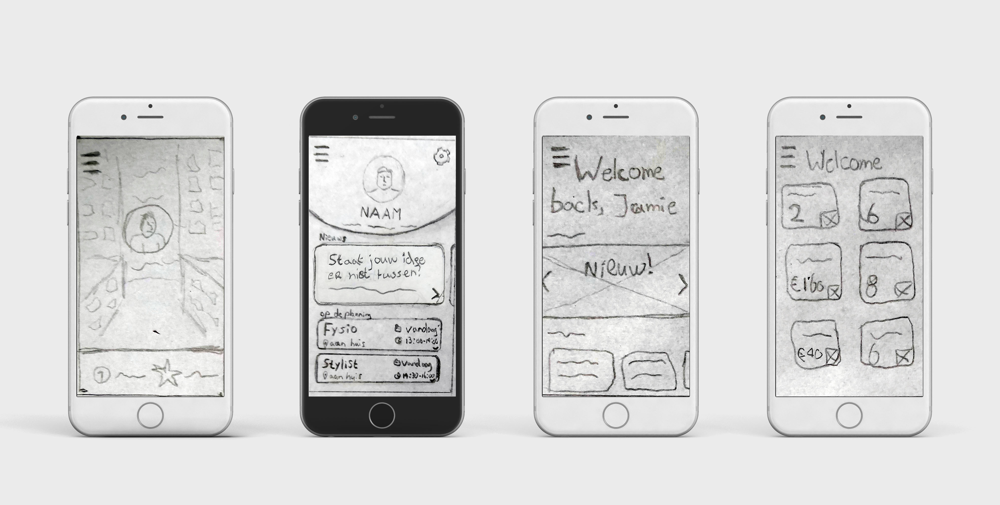

# 4. Paper Prototype

Het eerste prototype dat ik heb ontworpen is een paper prototype. Deze heb ik ontworpen om te kunnen testen op docenten en klasgenoten bij de feedback frenzy. Ik denk dat de doelgroep moeite zal hebben de schetsen te begrijpen, dus voordat ik met hen ga testen wil ik mijn prototype nog digitaliseren. De uitwerking hiervan heb ik met de hand getekend omdat ik in een korte tijd een duidelijk beeld wilde vormgeven over mijn gedachtes en ideeën voor het prototype. Het prototype bestaat uit 12 verschillende schermen.



### Testronde 1

**Testers:** Studenten en docenten tijdens de feedback frenzy.

**Doel van de test:** Mijn medestudenten en docenten mijn huidige concept presenteren zodat ze mij feedback kunnen geven. Er waren een aantal specifieke onderdelen wat ik wilde testen. Wat vinden mijn medestudenten en docenten van de layout van de homepagina? Lukt het om een afspraak te maken? Wordt het agenda overzicht begrepen? 

**Verwachtingen:** Ik denk dat ik bij de feedback frenzy snel inzichtelijk kan maken wat twijfelachtige keuzes zijn die ik heb gemaakt en hier alternatieve ideeën op zal krijgen.

Tijdens de feedback frenzy heb ik gesproken met verschillende studenten en docenten. Ik kreeg complimenten over bepaalde keuzes, maar ook twijfels over andere. De twijfels en punten van kritiek vind ik belangrijk en heb ik daarom genoteerd om verder aan te werken.

**Insights:**

* Suggesties geven: waarom kunnen ze alleen suggesties geven en niet gewoon een speciaal voor hun gemaakte afspraak ergens mee krijgen?
* Goed na gaan denken wat je precies wilt bereiken met de agenda.
* Andere view voor agenda? \(Maand/week/dag\)
* Hamburger menu is misschien wel helemaal niet nodig. Tabjes kan ook.
* Een titel toevoegen bij het overzicht.



