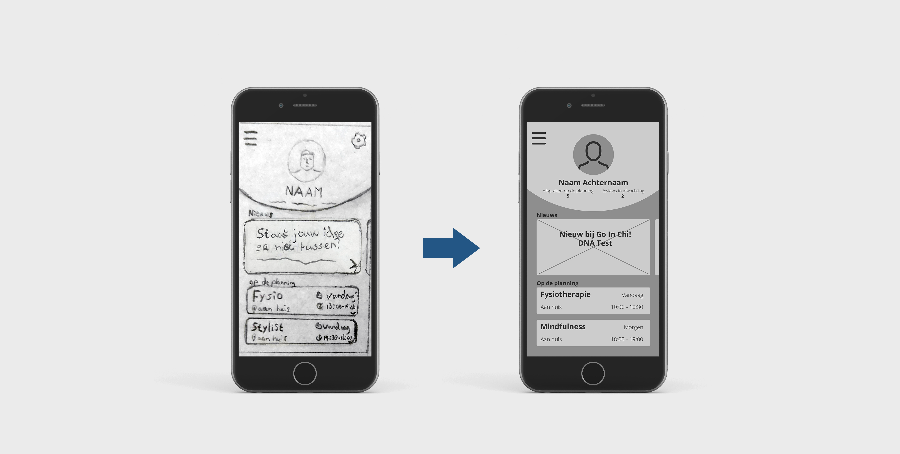

# 5. Lo-Fi Prototype

Met het handgetekende prototype kon ik bij mijn medestudenten en docenten goed vertellen en laten zien wat ik wilde zonder dat ze het niet begrepen. Bij mijn doelgroep denk ik dat dit een heel ander verhaal wordt. Daarom heb ik de schetsen gedigitaliseerd in een nieuw prototype.

Met de hulp van mijn opdrachtgever heb ik mijn prototype kunnen testen bij zes verschillende Pontsteiger bewoners. Verder heb ik zelf nog met vier andere mensen die niet in de Pontsteiger wonen getest. Dit zijn mensen die niet in de Pontsteiger wonen maar financieel gezien het vermogen hebben om een woning in de Pontsteiger te kunnen kopen. Dat heb ik gedaan omdat ik nog wat meer gebruikers wilde testen, maar ik geen afspraken meer kon maken met de doelgroep vanwege hun drukke schema's.

### Testronde 2

**Testers:** Zes Pontsteiger bewoners en vier personen buiten de doelgroep

**Doel van de test:** Bij deze test wil ik erachter komen of gebruikers makkelijk een nieuwe afspraak kunnen inplannen in de applicatie.

**Opdracht voor de tester:** Maak een nieuwe afspraak voor Manuele Therapie.

**Verwachtingen:** Ik verwacht dat gebruikers eerst rond zullen kijken maar wanneer ze op de services klikken ze zullen begrijpen dat hun doel hier te vinden is.

Dit was de eerste keer dat ik het prototype ben gaan testen met de doelgroep zelf. Daarom is het moeilijk om te voorspellen wat er zal gaan gebeuren. Ik hoopte vooraf dat de lo-fi onderdelen begrepen zouden worden door de testers, maar dit bleek toch nog wel een hindernis te zijn voor de meeste. Iets wat ik altijd probeer te vermijden is om testers nog extra tips/andere hulp te geven tijdens het testen van een prototype. Helaas was dit bij de helft van de gevallen toch nodig om het doel te bereiken.



**Werkelijke werking:** Het prototype werkt een stuk minder goed dan ik verwacht had. Gebruikers blijven vooral hangen bij de Agenda en weten het dan niet meer goed.

**Punten die opvielen:**

* In plaats van afbeeldingen heeft dit prototype kruizen waar deze later komen. Dit werkt verwarrend voor de gebruikers.
* Bijna niemand leest. Iedereen klikt eigenlijk maar wat rond zonder echt te lezen.
* De benamingen die ik heb gekozen werken niet zo goed. Het woord Services bijvoorbeeld is niet duidelijk.
* Ongeveer iedereen komt uit bij de Agenda. Hier zou dus bijvoorbeeld een plusje aan de onderkant kunnen komen om een nieuwe afspraak te maken.
* Het hamburger menu is toch wat onbekender voor sommige dan ik had verwacht. Met name de wat oudere mensen hadden hier vraagtekens bij.

