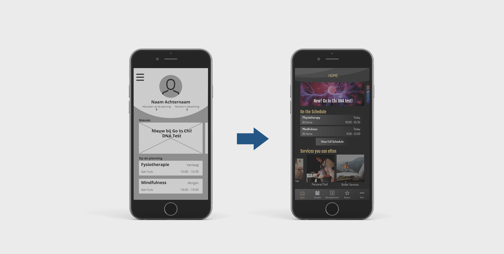
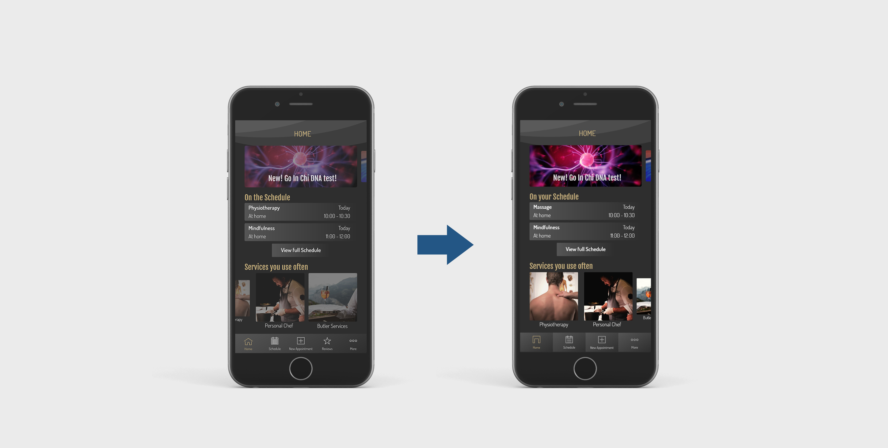

# 6. Hi-Fi Prototype

Na genoeg feedback te hebben verzameld over mijn Lo-Fi Prototype was het tijd om naar de Hi-Fi toe te gaan. Met een Hi-Fi prototype kan er ook getest worden, zonder dat er onderdelen niet worden begrepen door de kwaliteit van het design. In de Pontsteiger wonen niet alleen Nederlanders, maar ook inwoners die andere talen spreken. Hierdoor heb ik ervoor gekozen om dit prototype in het Engels te maken.



Mijn opdrachtgever had voor mij vijf Pontsteiger bewoners benaderd die graag mijn prototype wilden testen. Van deze vijf hadden twee eerder ook het Lo-Fi prototype getest. Bij de Lo-Fi was het voor deze testers allemaal nog niet heel duidelijk en zagen ze de app nog niet echt voor zich. Ik hoop dat dat met mijn nieuwe prototype anders is.

### Testronde 3

**Testers:** Vijf Pontsteiger bewoners

**Doel van de test:** Bij deze test wil ik erachter komen of gebruikers makkelijk een nieuwe afspraak kunnen inplannen in de applicatie.

**Opdracht voor de tester:**  Maak een nieuwe afspraak voor Fysio Therapie voor vandaag om zes uur.

**Verwachtingen:** Ik verwacht dat dit prototype duidelijker is dan het Lo-Fi prototype, vanwege de kwaliteit van de uitwerking en de aanpassingen die zijn gedaan bij het maken van dit prototype.

Nu er een duidelijker design is dan vorige keer verwacht ik dat alle verwarring uit de weg is die er vorige keer plaats vond.



**Werkelijke werking:** Het prototype werkt een stuk beter dan de vorige keer. Dit keer was er geen verwarring wat onderdelen precies deden. Eén gebruiker liep vast omdat ze niet begreep wat de agenda pagina precies was. In de agenda staat al een aantal afspraken, alsof de app niet voor het eerst gebruikt is. De gebruiker had dus niet zelf de afspraken gemaakt, waardoor ze in verwarring was.

**Punten die opvielen:**

* New Appointment is voor gebruikers veel duidelijker dan Services.
* De fysiotherapie afspraak, die op de homepagina in het kort te zien is bij "On the Schedule", leidt af. Omdat gebruikers de afspraak niet zelf hebben gemaakt is dit niet logisch voor hen.
* "On the Schedule" lijkt niet de beste titel te zijn. Het wordt opgevat als services die aangeboden worden.

De vorige test had een goede uitkomst, maar wat mij betreft is er nog genoeg ruimte voor verbetering. Daarom heb ik besloten om mijn prototype aan te passen en weer een nieuwe test met de doelgroep te doen. De lijst met aanpassingen staat in mijn product biografie.



### Testronde 4

**Testers:** vijf Pontsteiger bewoners

**Doel van de test:** Bij deze test wil ik erachter komen hoe snel gebruikers de app doorhebben. Ik wil weten of het maken van de tweede afspraak sneller gaat dan de eerste. Ook wil ik de agenda testen. Is het duidelijk voor de gebruikers hoe dit werkt? En een custom appointment, hebben de gebruikers een idee waar ze dit zouden kunnen vinden?

**Opdracht voor de tester:** Bij deze test heb ik de testers meerdere opdrachten gegeven, namelijk:

* Je hebt van je buurman positieve geluiden gehoord over mindfulness. Je besluit dit ook te willen proberen. Maak een afspraak op Dinsdag 9 April voor mindfulness om drie uur. 
* Je hebt vandaag om 10 uur een afspraak voor fysiotherapie staan, maar er is iets belangrijks tussen gekomen. Cancel deze afspraak.

Tussen deze opdrachten wordt de app opnieuw opgestart, zodat de gebruiker weer bij Home begint. Ik ben benieuwd of er ook gebruik word gemaakt van de shortcuts die op de homepagina staan.

* Je krijgt binnenkort vrienden op bezoek en wilt ze verassen met een etentje. Een personal chef klinkt daarom als een goed plan. Boek een afspraak bij een personal chef.
* Je wilt graag gebruik maken van een architect, maar Go In Chi biedt dat op moment helaas niet. Probeer een persoonlijke aangepaste afspraak te maken.
* Zet bij instellingen e-mail meldingen aan.

**Verwachtingen:** Ik denk dat de eerste opdracht even zoeken wordt, maar dat de gebruikers er wel vrij makkelijk uit zullen komen. De tweede en derde opdracht zijn denk ik de makkelijkste en zullen vrij snel voltooid worden. De vierde is denk ik wel wat lastiger en zal wat langer duren. De vijfde is denk ik weer simpeler, ook omdat gebruikers dan het "more" menu al gebruikt zullen hebben.



**Werkelijke werking:** Deze keer werkte mijn prototype beter dan ooit. Eigenlijk waren er geen grote problemen waar gebruikers tegenaan liepen. De ene gebruiker had wat meer moeite dan de andere, maar ze wisten allemaal binnen slechts een paar minuten hun eerste afspraak te boeken, wat wat mij betreft een heel goed uitgangspunt is. Het enige wat niet helemaal vlekkeloos verliep was het maken van de "Custom Appointment". Veel gebruikers besloten onder "New Appointment" te zoeken, wat eigenlijk ook wel logisch is. Wat denk ik een goede oplossing voor dit probleem zal zijn is om onderaan de pagina van de categorieën een bericht te maken met "Do you want something we're not offering? Why not try to make a custom appointment?" Deze kan dan doorlinken naar naar de "Custom Appointment" pagina.

**Punten die opvielen:**

* Een nieuwe afspraak maken is zo simpel dat het binnen 5 minuten lukt.
* Pagina's onder "More" vinden duurt iets langer dan de andere.
* Voor een persoonlijke afspraak zoeken gebruikers alsnog onder "New Appointment".

### Expert Review

Na mijn prototype weer getest te hebben heb ik deze ook nog bij twee experts mogen testen. Dit waren experts die in het dagelijks met user experience bezig zijn en daar dus veel ervaring mee hebben.



De experts kwamen erg enthousiast over mijn prototype op mij over, wat mij een goed gevoel geeft. Ze hadden natuurlijk wel wat puntjes van kritiek, maar daar hoopte ik juist op omdat ik zo met hun hulp mijn prototype kan verbeteren.Eén van hen had het idee om een community op te bouwen. Er zou nog onderzoek gedaan kunnen worden om erachter te komen of mijn doelgroep dit interessant vindt en hoe dit dan precies zou moeten werken. Voor mijn prototype denk ik alleen dat dit nu een te grote aanpassing is om nog door te voeren. Ik zie dit als toekomstvisie.

