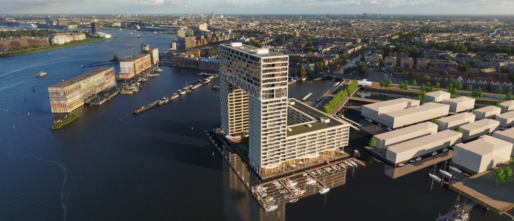

# 1.1 Intro

Voor mijn afstudeerproject wil ik graag een website of applicatie tot detail ontwerpen. Na mijn opleiding wil ik mij namelijk ook verder focussen op het ontwerpen en bouwen van soortgelijke websites en applicaties. Hiervan mijn laatste uitdaging binnen CMD maken, lijkt mij daarom een leerzame ervaring waarin ik ook mijn huidige opgebouwde kennis en vaardigheden toe kan passen. 

Via mijn vader ben ik in contact gekomen met Jeffrey Berkouwer, de oprichter van Go In Chi \(“Goinchi,” 2018\). Het doel van Jeffrey is het ontzorgen van zoveel mogelijk welvarende mensen. Dit wil hij doen door via een app een selectie aan verschillende services aan huis aan te bieden op het gebied van Health, Wealth en Happiness. De doelgroep waar Go In Chi zich nu op wil focussen bestaat uit de bewoners van de Pontsteiger in Amsterdam. Het ideale toekomstperspectief  is om uit te breiden naar meer woongebieden in Nederland, maar de eerste app zal exclusief voor de Pontsteiger bewoners zijn. Go In Chi gelooft in het motto “Time management is life management”. Je kunt slechts één keer je tijd goed benutten. Je zal je kostbare tijd niet meer terug krijgen. Hoe balanceer je deze schaarste om het optimale uit het leven van jezelf en van je naasten te halen? Het antwoord hierop kunnen de drukke bewoners vinden door gebruik te maken van de Go in Chi app.   
  
Voor dit project wil ik graag de applicatie in kwestie gaan ontwerpen, zodat deze na mijn eindproject door een developer van Go In Chi gebouwd kan worden. Mijn focus ligt hierbij op de User Experience. Ik vind het belangrijk dat ik aan het einde van mijn project met zekerheid durf te zeggen dat ik een goede oplossing voor het probleem heb gevonden.

De design challenge die ik voor dit project aangenomen heb, gaat als volgt:  
**“Hoe kan ik een exclusieve applicatie voor Go In Chi ontwerpen waarmee de bewoners van de Pontsteiger minder tijd verliezen door het boeken van diverse services?”**

Het project deel ik op in drie fases met allemaal hun eigen onderzoeksvragen. Om de onderzoeksvragen te beantwoorden zal ik geschikte onderzoeksmethoden zoeken om zo mijn vraag te kunnen beantwoorden\(“Stappen in onderzoek,” 2013\):

Fase 1: Verkenning

* Wie zijn de bewoners van de Pontsteiger?
* Hoe beleven de bewoners van de Pontsteiger de probleemsituatie momenteel?
* Wat zijn de behoeften van de Pontsteiger bewoners met betrekking tot Health, Wealth en Happiness?
* Wat doen vergelijkbare concurrenten?

Fase 2: Idee ontwikkeling

* Wat voor look & feel wil ik bij het ontwerp hebben?
* Wat zijn vergelijkbare apps? Welke werken goed en welke minder goed?
* Welke patterns kunnen in de app terug komen?
* Welke onderdelen moeten terugkomen in de app?

Fase 3: Ontwerp

* Welke onderdelen werken goed in het huidige prototype? Welke juist niet?
* Wat is de ideale flow? Hoe laat ik deze terug komen in de applicatie?
* Hoe kan ik met simpele micro interacties voor little big details zorgen die de ervaring van de applicatie verbeteren?
* Hoe breng ik een exclusief gevoel bij het gebruik van de applicatie tot stand?
* Is het ontwerp technisch haalbaar?
* Letten gebruikers op de onderdelen die ik belangrijk vind, of vallen minder belangrijke onderdelen meer op?
* Is de applicatie een oplossing voor het probleem?

