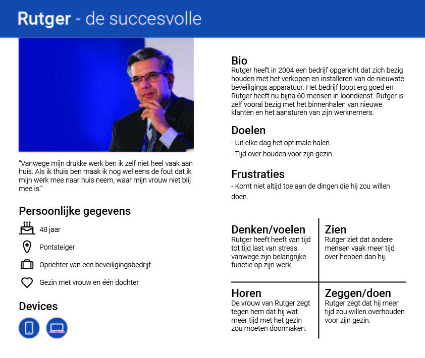
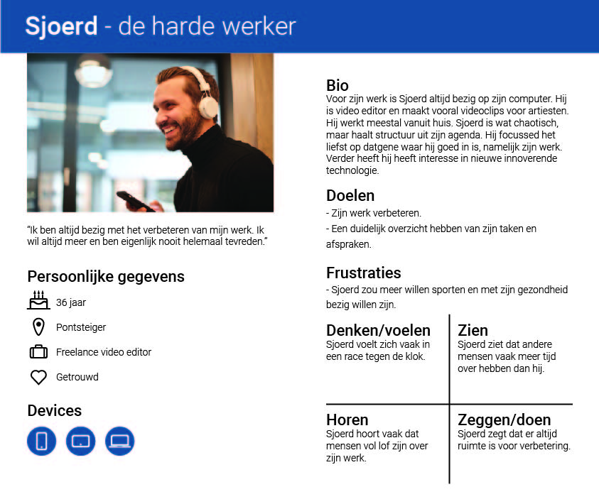
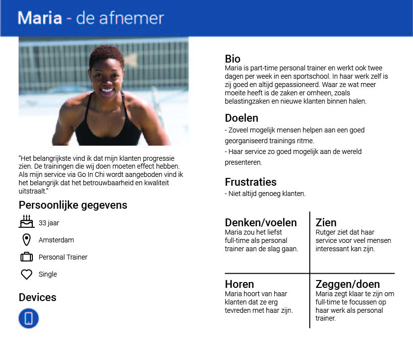

# 1.5 Job Stories en Persona's

### Job stories

Om de probleemsituatie duidelijk te framen, heb ik besloten om job stories te gebruiken. Deze zijn namelijk erg handig om een oorzakelijk verband gestructureerd en duidelijk weer te geven\(Klement, 2013\).Hiervoor gebruik ik het format "als ik... wil ik... zodat ik...". Dit format zorgt ervoor dat de motivaties van de Pontsteiger bewoners goed in kaart worden gebracht,  waardoor oplossingen gemakkelijk bedacht kunnen worden. In de tabel hieronder stel ik de drie vragen elk in een aparte kolom. Deze kunnen van links naar rechts gelezen worden. De informatie in de job stories zijn gebaseerd op de interviews die ik eerder heb afgelegd.

| Als ik... | wil ik | zodat ik |
| :--- | :--- | :--- |
| uit mijn werk kom, | het liefst tijd met mijn gezin besteden | de rest van de avond niet meer aan werk hoef te denken. |
| weekend heb, | het liefst niet bezig zijn met werk | leuke dingen kan doen met mijn echtgenoot. |
| weekend heb, | geen klusjes hoeven doen | tijd heb om leuke dingen te doen, zoals beauty dingen. |
| een drukke dag heb gehad, | iemand hebben die mijn klusjes kan doen | meer vrije tijd heb. |
| gebruik wil maken van een nieuwe dienst, | niet veel tijd kwijt zijn om uit te zoeken wat de beste is | niet mijn vrije tijd hieraan kwijt ben. |
| gebruik wil maken van een nieuwe dienst, | de garantie hebben dat dit een goede service is | niet helemaal moet onderzoeken wat het beste voor mij is. |
| aan mijn werk denk, | wil ik altijd vernieuwen en verbeteren | meer klanten kan krijgen. |
| mijn service via een externe app aanbied, | dat mijn service goed  gerepresenteerd wordt | een goed beeld aan potentiële klanten geef. |

### Persona's

Door verschillende onderzoeksmethodes toe te hebben gepast, heb ik een uitgebreid en volledig beeld gekregen van de doelgroep. Om deze visual in kaart te brengen heb ik deze in een persona verwerkt. Deze persona’s zijn natuurlijk vrij algemeen en gelden niet voor iedereen, maar het is naar mijn mening een redelijk goede weerspiegeling van de doelgroep.

De persona's van Rutger en Sjoerd lijken misschien op elkaar, maar zijn toch heel anders. Het verschil is vooral de fase in het leven waarin ze zich bevinden. Rutger, de succesvolle, heeft het al gemaakt. Hij heeft een succesvol bedrijf terwijl Sjoerd, de harde werker, nog bezig is om op dit niveau te komen.

