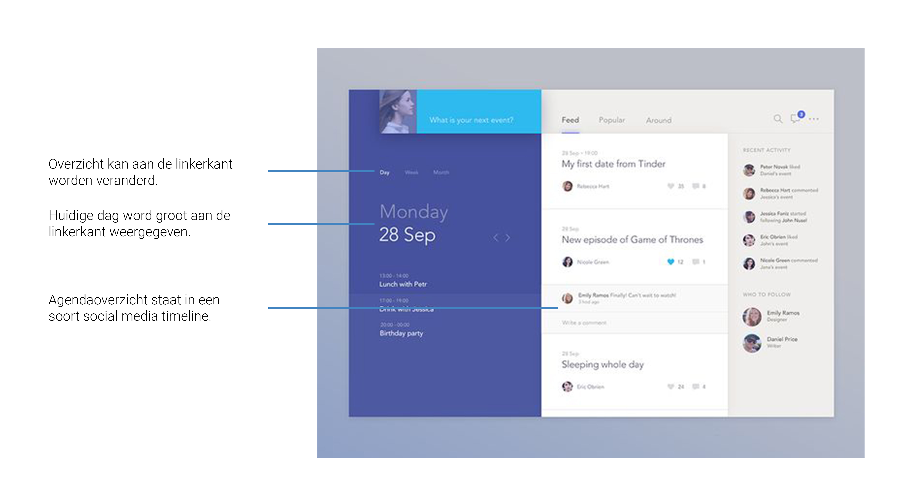

# 2.4 Benchmark

Omdat een aantal belangrijke onderdelen van het Go In Chi platform ook al in andere apps en websites is gemaakt, lijkt het mij een slim idee om een kijkje te nemen hoe dit dan precies wordt aangepakt. Ik heb gekeken naar het boeken van de services en de agenda omdat idit naar mijns inziens de belangrijkste onderdelen zijn binnen Go In Chi. Ik heb gekeken naar een aantal verschillende ontwerpen en de interessante delen voor mij uitgelicht met annotaties. Dit zal ik hieronder toelichten.

### Afspraak maken

Hier kan een afspraak gemaakt worden door een tijdslot te selecteren dat nog open staat. Dit is een interessante manier om gebruikers een keuze te laten maken. Het nadeel dat ik hier wel in zie is dat er een mogelijkheid is dat de gebruiker heel veel data en tijden te zien krijgt die niet toegankelijk zijn. Hiermee wordt namelijk de kans op een fout groter, wat voor gebruikers nooit prettig is.

Het linkerscherm geeft een herkenbaar overzicht van datum en tijd weer. Er wordt verondersteld dat men bekend is met de vaak voorkomende kalender. De knoppen met tijden zijn ook gemakkelijk om te begrijpen en te gebruiken . Dit duidt op een goede gebruiksvriendelijkheid. 

Het rechterscherm is interessant voor services met ingewikkeldere stappen. Bij een vraag met meerdere opties wordt gebruik gemaakt van een dropdown menu. De gebruiksvriendelijkheid wordt bevorderd, omdat de opties zo minimale ruimte in beslag nemen en het overzicht goed bewaren. Bij datums wordt gebruik gemaakt van een slider die wederom ervoor zorgt dat minimale ruimte in beslag wordt genomen. Een kalender zou  hier de pagina een stuk voller kunnen maken. De dagen worden weer mooi als knoppen weergegeven.Tot slot is het nog opmerkelijk dat bij de "Book Now" knop onderaan de prijs wordt weergegeven om gebruikers duidelijk te laten weten wat ze zullen uitgeven. Dit zou met name interessant kunnen zijn als een service een variërende prijs heeft.

In dit voorbeeld wordt een duidelijke bevestiging gegeven dat een gebruiker een afspraak heeft gemaakt. Dit is goede feedback voor de gebruiker, omdat het duidelijk is wat er is gebeurd. Deze melding wijst daarna door naar de agenda. 

### Agenda

In deze agenda krijgt de gebruiker de optie om de agenda weer te geven op dag, week en maand. Dit geeft de gebruiker de mogelijkheid om zijn of haar eigen voorkeur te gebruiken. De grote titel daaronder geeft groot de datum en dag weer, zodat er geen verwarring kan ontstaan. Aan de rechterkant wordt een social media timeline weergegeven die met de datum te maken lijkt te hebben. In dit voorbeeld is het lastiger om te begrijpen hoe het precies werkt zonder de context, maar het overzicht aan de linkerkant biedt wel een volledige weergave, omdat het minimaal is, maar toch alle nodige informatie geeft.

Het linkerscherm is interessant om de volgende redenen die in dit stuk besproken worden. Ten eerste wordt de dag bovenaan weergegeven in een slider die uit afkortingen bestaat. Hierdoor nemen de dagen maar weinig ruimte in beslag en kan er een hele week op worden weergegeven. De maand en het jaar worden ook los boven weergegeven, zodat de datum van de dag in slechts twee getallen kan worden weergegeven. Daaronder wordt de agenda in een timeline weergegeven. Hierdoor zijn er geen lege ruimtes in de agenda als de gebruiker op dat moment er niks op heeft staan. Onderaan staat een grote knop die erg opvalt door de kleur die hij heeft. Deze knop heeft alleen een plusje erop, wat een indicatie is voor een knop om iets toe te voegen.

Rechts zien we een een ander soort timeline. Deze geeft afspraken weer in blokken onder elkaar. Dit is is duidelijker dan het linkerscherm als de gebruiker meerdere afspraken tegelijk heeft lopen. Dit zou bij Go In Chi niet van toepassing kunnen zijn, omdat de gebruiker over het algemeen niet meerdere services tegelijk kan gebruiken. Het zou in sommige gevallen wel kunnen, maar het is niet de normale situatie.

Bij deze laatste twee schermen is te zien dat in het linker scherm een teaser van de agenda wordt weergegeven. De eerstkomende afspraak wordt in een groot formaat weergegeven. Dit kan handig zijn als een gebruiker voor de afspraak nog even snel de gegevens wil controleren. 

In het rechterscherm is de agenda als geheel te zien. De dagen zijn ieder in een eigen blok weergegeven. Dit geeft een duidelijk onderscheid tussen de afspraken.


Onderzoeksvraag: Ik heb op Pinterest gekeken naar designs van apps met dezelfde onderdelen als ik denk dat Go In Chi moet hebben. Dit overzicht geeft voor mij de beste voorbeelden weer. Ik denk dat de beste designs de simpelste zijn omdat je al gelijk een verwachting hebt hoe het precies zou moeten werken.


