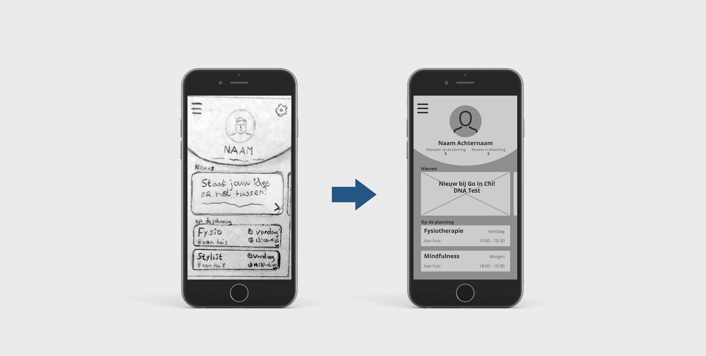

# 2.7 Lo-Fi Prototype

Twee dagen na de feedback frenzy had ik een afspraak met een groepje mensen uit mijn doelgroep om mijn prototype te testen. Omdat ik niet met tekeningen wilde aankomen bij de doelgroep heb ik ervoor gekozen om een Lo-Fi Prototype te maken, zodat de gebruikers beter kunnen begrijpen wat er in beeld wordt gebracht. Dit prototype is qua werking hetzelfde als mijn paper prototype. Het verschil zit hier echt in de looks.





