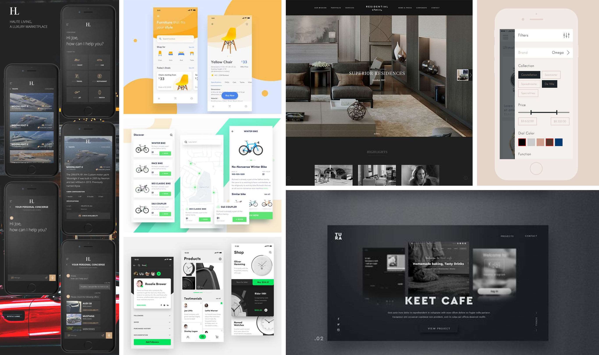
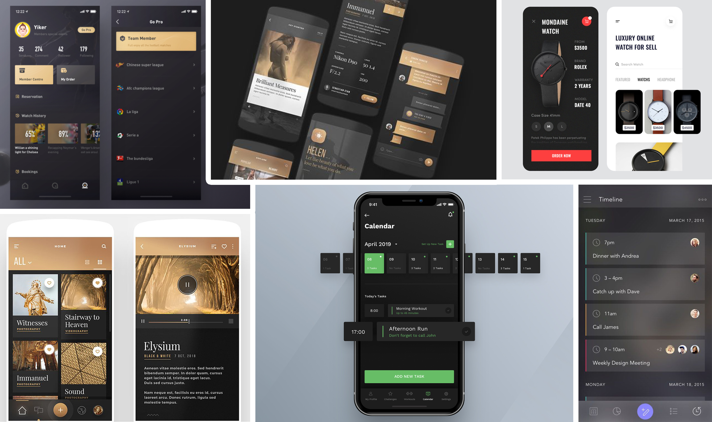

# 2.3 Moodboards

Go In Chi is een platform die is bedoeld voor de Pontsteiger bewoners. Eerder tijdens het doen van Desk Research heb ik al geconcludeerd dat deze mensen erg welvarend zijn en aangezien ze in de Pontsteiger wonen, duidelijk niet vies zijn van wat luxe. Dit is belangrijk om ook in het ontwerp van Go In Chi mee te nemen, omdat het de doelgroep natuurlijk moet aanspreken.

### Look & Feel

Veel luxueuze apps, zoals in het voorbeeld hierboven, maken gebruik van vrij veel witruimte en laten de belangrijke content daardoor goed naar voren komen. Dit straalt veel rust uit. Door alleen de belangrijke onderdelen te laten zien, worden zo ook misverstanden vermeden.

De open ruimtes kunnen ook gezien worden als metafoor voor luxe woningen. Woningen met veel open ruimte ogen luxer dan woningen die vol staan en weinig ruimte hebben. Zoals in de afbeelding hierboven te zien is vallen de woningen in de Pontsteiger duidelijk onder het eerste.

### Typografie

Typografie is altijd een interessant onderdeel aan design omdat het de sfeer heel drastisch kan aanpassen. Het valt mij op dat de luxe applicaties altijd gebruik maken van duidelijk leesbare fonts en dat de tekst vrij veel ruimte krijgt. De teksten bestaan vrijwel altijd uit schreefloze letters. Ik vind persoonlijk dat deze over het algemeen ook leesbaarder zijn dan letters met schreef. 

Voor de titels worden regelmatig lettertypes met schreef gebruikt. Ook schreefloze worden gebruikt, maar toch wat minder vaak. Ik ben alleen van mening dat hier nog een belangrijke factor een rol speelt, namelijk het feit dat Go In Chi een digitaal product is. Voor digitale ontwerpen vind ik zelf dat een schreefloze letter beter tot zijn recht komt\(“How and When Should You Use Sans Serif Type?”, 2019\). Omdat Go In Chi een digitaal product is, en daarom eigenlijk alleen maar op beeldschermen bekeken wordt, heb ik ervoor gekozen om schreefloze letters te gebruiken.

### Kleur

Het eerste wat mij opvalt als ik kijk naar het design van een luxueuze app, is de kleur. De grote hoeveelheid van deze designs bestaan uit de combinatie van zwart en goud. Goud geeft een gevoel van prestige en rijkdom\(Rikard, 2018\). Binnen sport/competities is goud ook de kleur die wij associëren met de nummer 1, waardoor goud het gevoel geeft alsof het het beste van het beste is. Deze kleur wordt vaak met zwart gecombineerd, omdat de twee kleuren een magnifiek contrast hebben met elkaar. Deze kleurcombinatie wil ik daarom  terug laten komen bij Go In Chi.

