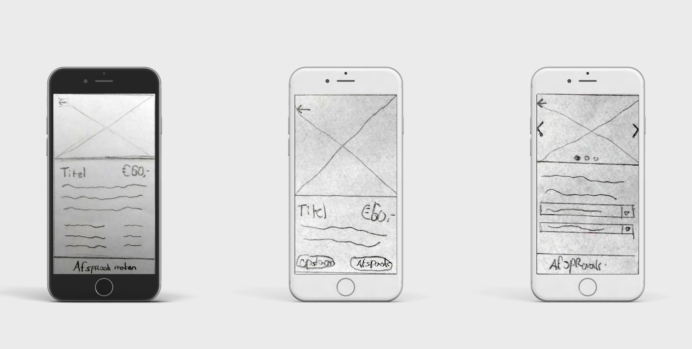
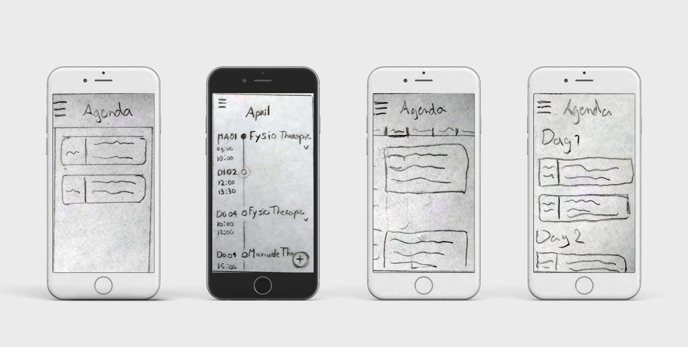

# 2.5 Paper Prototype

Na verschillende onderzoeken te hebben gedaan, die in de voorgaande hoofdstukken zijn toegelicht, werd het tijd om aan het eerste prototype te werken. De eisen die ik heb opgesteld in het ''Programma van Eisen'' kunnen handig zijn bij het maken van het prototype, omdat de richtlijnen gebruikt kunnen worden bij het vaststellen van de voorwaarden waar de applicatie aan moet voldoen. 

Mijn eerste prototype ga ik gebruiken bij de Feedback Frenzy met het doel om mijn ideeën te visualiseren aan klasgenoten en docenten. Voor ik daadwerkelijk met de doelgroep ga testen wil ik deze dus nog eerst digitaliseren, omdat ik verwacht dat zij de schetsen minder goed zal begrijpen.

Het prototype bestaat uiteindelijk uit 12 schermen. Het prototype heeft twee core features die het belangrijkst zouden kunnen zijn voor succes. Dit zijn de services en de agenda.

### **Dashboard**

Voor de homepagina waren diverse layouts mogelijk. Uiteindelijk is de keuze op het tweede scherm gevallen. Deze pagina geeft een soort globaal overzicht van verschillende onderdelen die binnen de app terug gevonden kunnen worden. Bovenin staat informatie over de gebruiker met onder andere een aantal meldingen. Daaronder is een slider te vinden met verschillende nieuwsberichten. Via dit overzicht kan Go In Chi nieuwe services uitlichten en eventueel andere berichten delen met de gebruikers. Daaronder staat in het kort de agenda. Als de gebruiker hier op klikt, gaat hij of zij verder naar het volledige overzicht. 

Het probleem bij het eerste en vierde scherm is eigenlijk dat het weinig laat zien. Veel ruimte wordt gebruikt voor vormgeving, wat ik een beetje zonde vind. Het derde scherm is qua inhoud ongeveer hetzelfde als de tweede, maar die stijl sprak mij net wat meer aan.

### Services

De services die door Go In Chi worden aangeboden zijn eigenlijk de hoofdfunctie van de applicatie. Op de weergegeven pagina kunnen gebruikers eerst filteren op Health, Business, Lifestyle en Assistance. Ik heb voor het derde scherm gekozen, omdat dit het duidelijkste en meest gestructureerde overzicht geeft dat goed past bij de vormgeving van de rest van het prototype, in tegenstelling tot het tweede scherm. Apps zoals H&M\(“Home H&M”, 2019\) maken hier ook succesvol gebruik van. Wanneer de gebruiker een keuze heeft gemaakt, verschijnt het overzicht van de services dat Go In Chi binnen deze categorie aanbiedt. 

### Service Detail

Wanneer de gebruiker een service heeft gevonden, kan hierop worden doorgeklikt. De detailpagina van de service zal dan naar voren komen. Hier heb ik voor het eerste design gekozen. De call to action knop is hier erg duidelijk, wat een positieve eigenschap is, want dat is het doel van de gebruiker. Verder wordt op de pagina informatie gegeven over de service, zodat de gebruiker beter weet wat er verwacht kan worden. Een app die ongeveer hetzelfde doet is die van Albert Heijn\(AH, 2019\). Het enige verschil is eigenlijk dat ik ervoor heb gekozen de call to action knop niet boven de tekst te plaatsen, maar eronder. Naar mijns inziens werkt dit bij Albert Heijn app beter door de grote hoeveelheid aan informatie die door dat bedrijf wordt aangeboden. Bij Go In Chi zal dit wat beperkter zijn, dus ben ik van mening dat de call to action knop beter onderaan kan staan, dus beter in bereik van de duim van de gebruiker.

### Agenda

Een andere belangrijke feature binnen het prototype is de agenda. Ik heb diverse ideeën gehad voor deze pagina, maar de keuze is gevallen op het tweede scherm. Er wordt verwacht dat de gebruiker die deze pagina bezoekt, vooral wil weten wat hem of haar die dag en de komende dagen te wachten staat. De timeline indeling zou hier ideaal voor kunnen zijn. Alle gemaakte afspraken zullen opgeslagen worden in de agenda en kunnen daar dus ook teruggevonden worden. Deze worden direct onder elkaar geplaatst. Als er een dag geen afspraak is, zal deze dag niet op de timeline te vinden zijn.

### **Kosten**

De opdrachtgever is er nog niet over uit hoe Go In Chi precies betaald moet worden. Dit is de reden waarom deze pagina voor nu leeg gelaten is.

### **Reviews**

Go In Chi wil alleen het beste van het beste aanbieden. Daarom is klanttevredenheid erg belangrijk. Go In Chi wil om deze reden gebruik maken van een review systeem waarmee gebruikers gebruikte services met een aantal sterren kunnen beoordelen \(één tot vijf\). Als een service meerdere keren onder de vier sterren scoort, is dit voor Go In Chi kwalitatief te laag om aan de gebruikers aan te bieden. Omdat de reviews dus belangrijk zijn voor Go In Chi, zal er een melding in het menu naast de knop “Reviews” komen te staan om gebruikers ook te triggeren om dit te gebruiken.

### **Suggesties**

Als Go In Chi een service niet aanbiedt waar wel vraag naar is, kan de gebruiker een suggestie achterlaten. Als dezelfde vraag meerdere malen terugkomt, kan Go In Chi ervoor zorgen dat dit in de toekomst ook aangeboden kan worden.

### **Instellingen**

In dit deel van het proces is het moeizaam om te zeggen wat voor instellingen precies belangrijk zijn bij Go In Chi. Er wordt namelijk verwacht dat er steeds meer instellingen bijkomen. Dat verwacht ik omdat ik nog niet op de doelgroep heb getest. Voor nu heb ik deze pagina daarom leeg gelaten.

### Uitloggen

Deze pagina is heel eenvoudig. Deze laat de gebruiker uitloggen.



