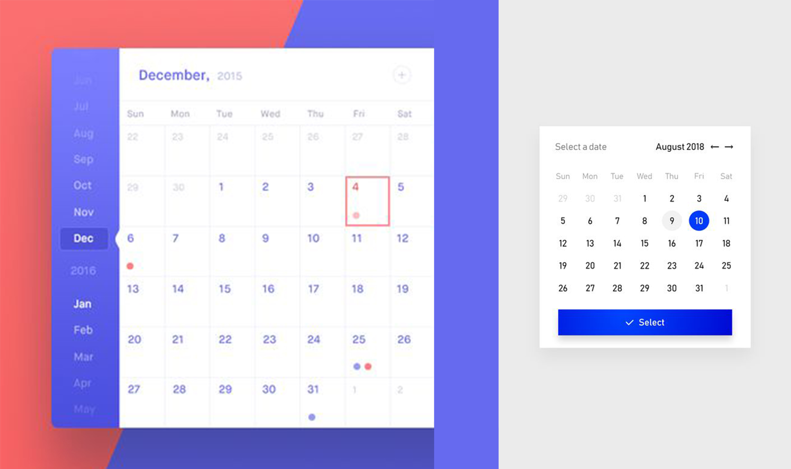
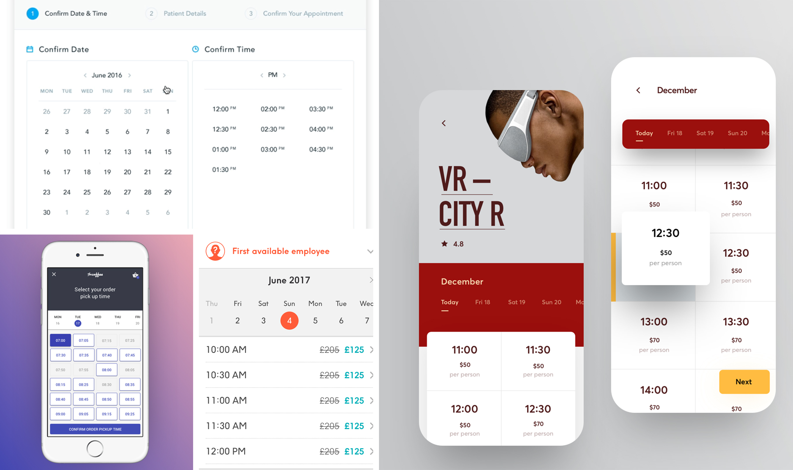
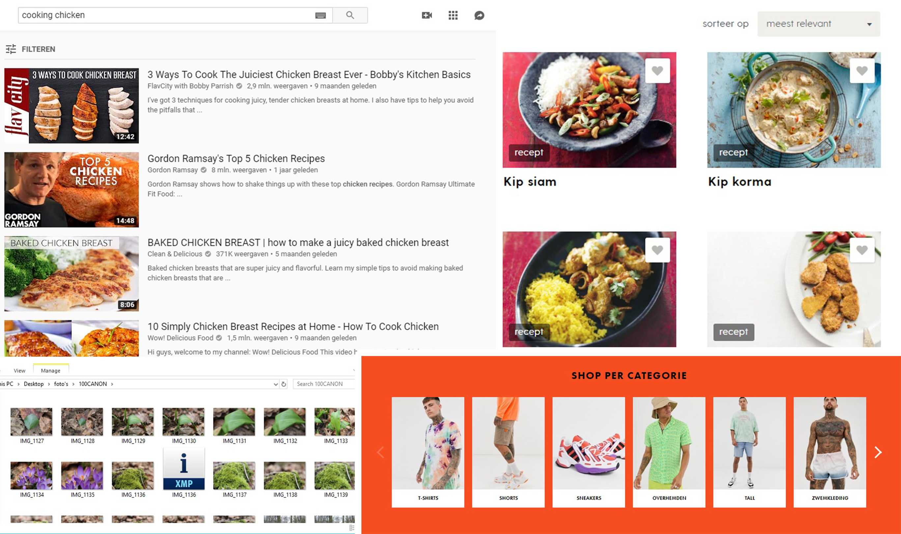

# 2.1 Patterns

Om een goede applicatie te maken is het van belang om goed te kijken hoe bepaalde functies het beste tot hun recht komen. Zo is het van belang om gebruik te maken van vaak voorkomende patronen, omdat de bekendheid bevorderend is voor de user experience. Gebruikers die de applicatie nog nooit gebruikt hebben kunnen op die manier toch bekend zijn met de elementen die erin voorkomen. \(Tidwell, 2010\)

### Home

Op de homepagina wil ik een samenvattend overzicht geven van wat de app te bieden heeft. Hierin wil ik doorlinken naar de belangrijkste onderdelen, zoals het gebruiken van de services die Go In Chi aanbiedt. Ook lijkt dit mij een goede plek om nieuws binnen Go In Chi te laten zien. Als Go In Chi een nieuwe service toevoegt, kan dit hier getoond worden. 

#### Carrousel

Het nieuws kan worden weergegeven in een carousel. Dit is een overzichtelijke manier om meerdere nieuwsberichten te tonen zonder ze allemaal in een lijst te plaatsen\(“Carrousel - Interaction Design Pattern Library - Welie.com”, 2007\). Dit zorgt er ook voor dat de aandacht van de gebruiker meer de focus heeft op één nieuwsbericht tegelijk\(“Carousel design pattern”, 2008\).

### Services

Het hoofddoel van het platform is het boeken van de verschillende services die Go In Chi aanbiedt. Daarom is het belangrijk dat dit proces voor de doelgroep makkelijk te voltooien is. De benodigde informatie zal per service verschillend zijn. Toch zal het zo zijn dat bepaalde elementen vaker terug komen, zoals het kiezen van een datum en tijd of het selecteren uit meerdere opties.

#### Datum

Om de gebruiker een datum te laten selecteren lijkt het mij het beste om gebruik te maken van een kalender. Dit geeft gebruikers de optie om een daadwerkelijke datum te selecteren wat tot minder fouten zal leiden dan als de gebruikers dit bijvoorbeeld zelf zouden moeten typen\(“Calendar Picker design pattern”, 2008\).

#### Tijd

Datum en tijd gaan bij het maken van een afspraak hand in hand. Dat komt omdat de beschikbare tijden per datum zullen verschillen, omdat er misschien andere werktijden zijn of bepaalde tijden al bezet zijn. Daarom is het belangrijk de tijd gelijk na de datum weer te geven. 

Een andere interessante pattern is het beperkt houden van de tijd opties. Daarmee wordt bedoeld dat alleen beschikbare tijden weergegeven worden. Als een service bijvoorbeeld op een dag drie verschillende tijden aanbiedt, namelijk om 1 uur, 2 uur en 3 uur, maar 2 uur al bezet is, wordt deze optie niet meer weergegeven. De gebruiker krijgt dus alleen de opties 1 uur en 3 uur te zien. Hierdoor is het voor de gebruiker makkelijker om te kiezen en is er minder ruimte om fouten te maken\(“Limited choice design pattern”, 2008\).

#### Thumbnails

Om gebruikers meer context bij een service te geven, zou ik in het overzicht van de verschillende services gebruik willen maken van thumbnails. Door thumbnails toe te voegen kunnen gebruikers sneller door een overzicht heen browsen en bij de services gelijk een idee krijgen wat de service precies inhoudt\(“Thumbnail - Interaction Design Pattern Library - Welie.com”, 2007\). In het beste scenario snapt de gebruiker zonder te lezen al gelijk wat er aangeboden wordt. Thumbnails worden heel erg veel gebruikt bij allerlei soorten websites en apps. Daarom is dit een pattern waar gebruikers al bekend mee zullen zijn waardoor hun user experience bevorderd wordt.

### 

### Reviews

Jeffrey wilt voor Go In Chi gebruik maken van een rating systeem. Dit wil hij doen omdat hij het van belang vindt dat Go In Chi slechts de beste services aanbiedt. Om gebruikers aan te sporen om deze reviews ook achter te laten, zou het nuttig kunnen zijn dat er gebruik wordt gemaakt van een simpel systeem waar gebruikers al bekend mee zijn.

#### Rating

Doormiddel van een rating systeem kan Go In Chi een garantie geven dat de services die zij aanbiedt, altijd van hoge kwaliteit zijn\(“Rating - Interaction Design Pattern Library - Welie.com”, 2007\). De twee meest gebruikte rating systemen zijn ratings doormiddel van sterren of doormiddel van een like/dislike. Door het sterren systeem te gebruiken zouden gebruikers  duidelijk aan kunnen geven wat ze precies vonden van de ervaring en Go In Chi kan bepalen of een service goed genoeg is om aan te bieden. Services die onder de vier sterren scoren voldoen niet aan de eisen. Er kan dan vervolgens gekozen worden om de service niet meer aan te bieden.

#### Buttons

Alle websites en apps bevatten links die door de makers toegevoegd zijn met het doel dat de gebruikers deze zo vaak mogelijk aanklikken. Sommigen zijn belangrijker dan anderen. De belangrijkste links kunnen worden weergegeven als een button\(“Action Button - Interaction Design Pattern Library - Welie.com”, 2007\). Om buttons onderling van elkaar te kunnen onderscheiden in hiërarchie kunnen verschillende aanpassingen worden gemaakt. Hierbij kan bijvoorbeeld gedacht worden aan kleur, formaat en hoeveel wit ruimte er om de button heen is.


Onderzoeksvraag: Er zijn veel verschillende goede patterns. Degene die ik in Go In Chi terug denk te zien komen heb ik in dit onderzoek verder toegelicht. De genoemde 


### Bronnenlijst

* Action Button - Interaction Design Pattern Library - Welie.com. \(2007\). Geraadpleegd op 18 augustus 2019, van http://www.welie.com/patterns/showPattern.php?patternID=action-button
* Calendar Picker design pattern. \(2008\). Geraadpleegd op 18 augustus 2019, van http://ui-patterns.com/patterns/CalendarPicker
* Carousel design pattern. \(2008\). Geraadpleegd op 18 augustus 2019, van http://ui-patterns.com/patterns/Carousel
* Carrousel - Interaction Design Pattern Library - Welie.com. \(2007\). Geraadpleegd op 18 augustus 2019, van http://www.welie.com/patterns/showPattern.php?patternID=carrousel
* Limited choice design pattern. \(2008\). Geraadpleegd op 18 augustus 2019, van http://ui-patterns.com/patterns/Limited-choice
* Rating - Interaction Design Pattern Library - Welie.com. \(2007\). Geraadpleegd op 18 augustus 2019, van http://www.welie.com/patterns/showPattern.php?patternID=rating
* Thumbnail - Interaction Design Pattern Library - Welie.com. \(2007\). Geraadpleegd op 18 augustus 2019, van http://www.welie.com/patterns/showPattern.php?patternID=thumbnail
* Tidwell, J. \(2010\). Designing Interfaces \(2e ed.\). Sebastopol, United States: O'Reilly Media.

