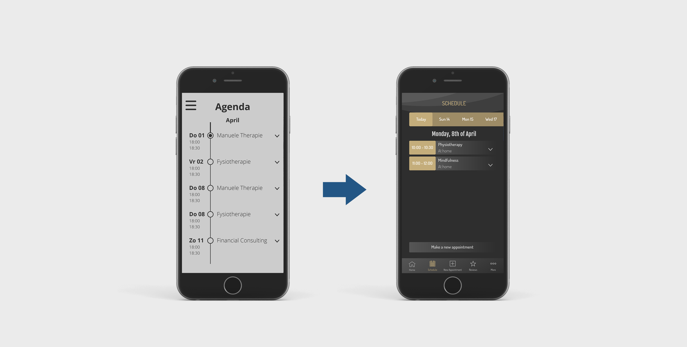
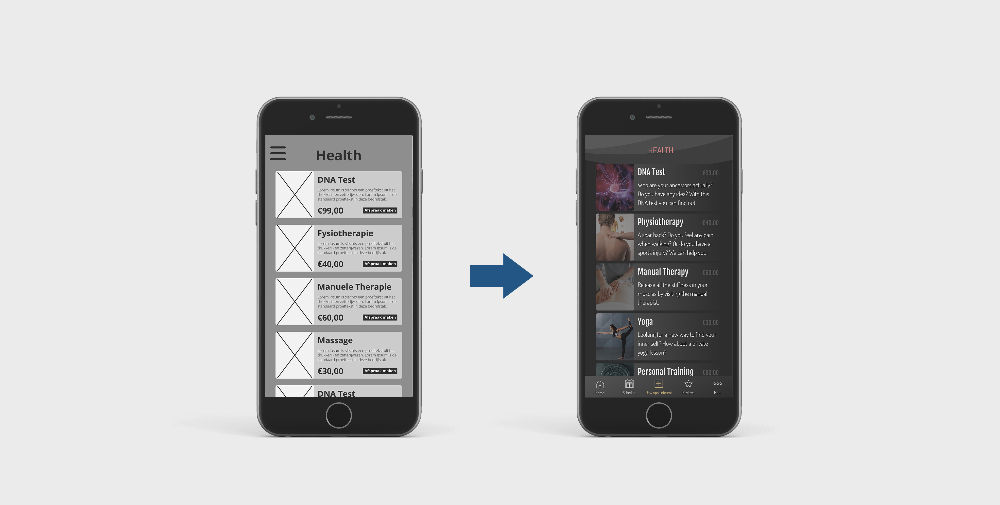
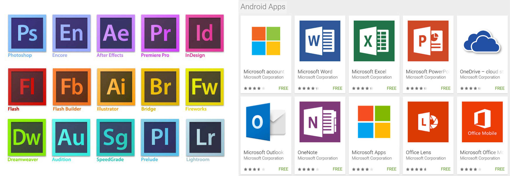
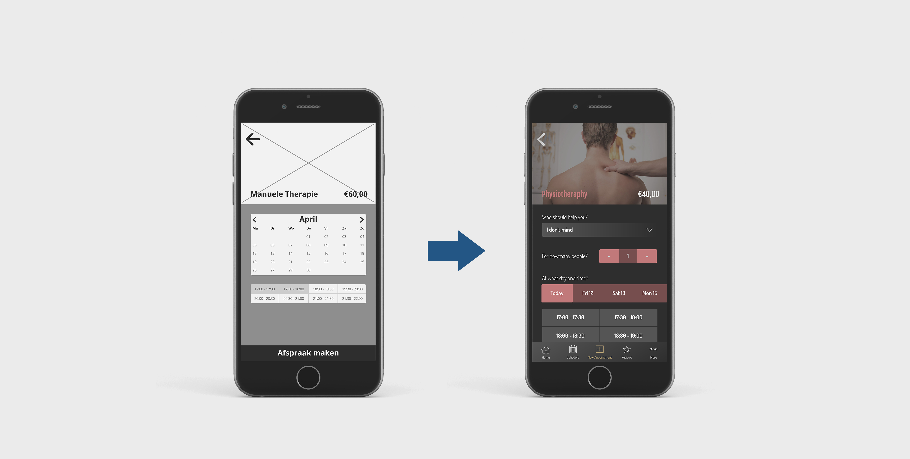
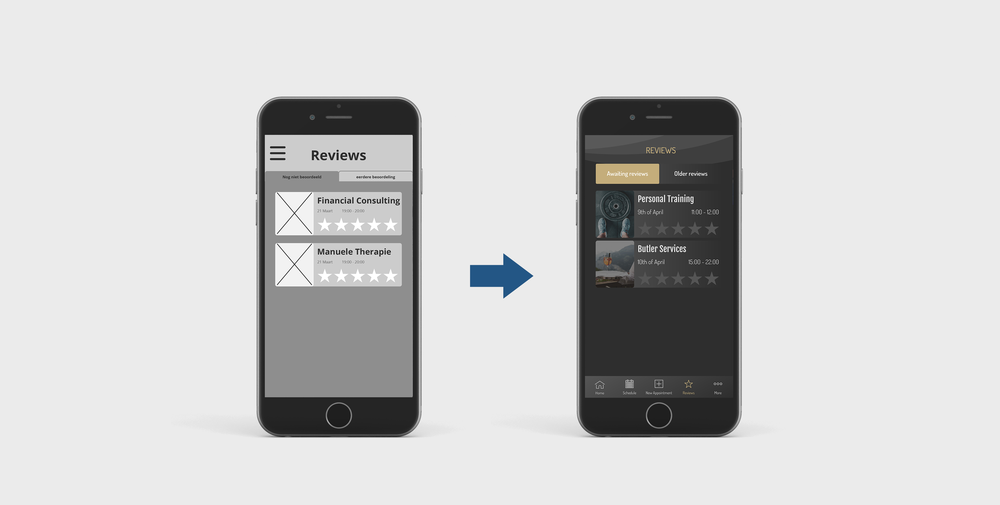

# 3.3 Hi-Fi Prototype

Na genoeg feedback te hebben verzameld over mijn Lo-Fi Prototype was het tijd om naar de Hi-Fi toe te gaan. Met een Hi-Fi prototype kan er ook getest worden, zonder dat er onderdelen niet worden begrepen door de kwaliteit van het design. In de Pontsteiger wonen niet alleen Nederlanders, maar ook inwoners die andere talen spreken. Hierdoor heb ik ervoor gekozen om dit prototype in het Engels te maken.  

### Home

De homepagina heeft een makeover gekregen ten opzichte van vorige keer. Ik ben namelijk tot de conclusie gekomen dat het eigenlijk nergens voor nodig is om een profielfoto bovenaan te hebben staan. De gebruikers zijn namelijk naar mijns inziens niet een doelgroep die hier interesse in toont. Twee van hen gaven ook vanzelf aan dit niet belangrijk te vinden. Verder zit de nieuws slider er nog steeds in. Via deze kan Go In Chi nieuwe updates toevoegen en zo bijvoorbeeld nieuwe services uitlichten.  

In het midden staat de  huidige agenda van de gebruiker in het kort weergegeven. Als hij of zij snel de eerstvolgende afspraak terug wil zien, is deze gelijk in beeld wanneer de app wordt geopend. Als de gebruiker hierop klikt, wordt hij doorgestuurd naar de agenda pagina.  

Onderaan is nog een slider te vinden met de services die deze gebruiker het meest gebruikt. Waarschijnlijk zullen er per gebruiker een aantal services zijn die hij/zij vaker gebruikt dan andere. Deze zijn via deze slider snel toegankelijk, zodat de gebruiker niet tussen alle andere services hoeft te zoeken, maar slechts tussen een paar. Deze functie wordt ook in andere apps vaker gebruikt, bijvoorbeeld in Spotify\(Spotify, 2019\).

### Agenda

De agenda pagina moet werken als een clean, overzichtelijke pagina waar de gebruiker snel in terug kan zien wat er op zijn/haar planning staat. De tijdlijn die ik voorheen gebruikte werkte niet zo goed bij de gebruikers als dat ik hoopte. Sommigen zagen de tijdlijn er namelijk niet in. Daarom heb ik besloten om het zo simpel mogelijk te houden. De afspraken staan nu allemaal in een los blok waarin de tijd is uitgelicht.  

Een belangrijke keuze die ik heb gemaakt op deze pagina is het gebruiken van een slider voor de datum selectie. De belangrijkste reden hiervoor is dat de app realistisch moet blijven op alle fronten. Daarmee bedoel ik dus ook voor de afnemers. Het moet niet zo kunnen zijn dat men een afspraak kan maken met een personal trainer voor over acht maanden. Dat zou namelijk betekenen dat de Personal Trainer zijn dagindeling voor over acht maanden al zou moeten weten. Uit eerdere interviews met afnemers bleek al dat hun klanten normaal gesproken maximaal tot twee weken vooruit plannen. Daarom wil ik dat de agenda tot maximaal drie weken vooruit loopt.  
  

### Nieuwe afspraak

“Services” bleek geen goede naam te zijn voor het maken van een nieuwe afspraak. Veel gebruikers hadden niet door dat ze hier afspraken konden maken. Daarom is dat nu veranderd naar “New Appointment”. Verder is het overzicht aan services eigenlijk hetzelfde gebleven als in het vorige design. De structuur is duidelijk voor gebruikers, omdat het redelijk overeenkomt met hoe de meeste webshops ongeveer werken.  

Iedere categorie heeft een eigen kleur om zich zo beter te onderscheiden van de rest. Dit maakt een duidelijker onderscheid tussen bijvoorbeeld de Health en Wealth sectie van de app. 

Voorbeelden van bedrijven die ook onderscheid maken doormiddel van kleur zijn Adobe en Microsoft. 

### Afspraak maken

Bij het maken van een afspraak zijn een hoop nieuwe details toegevoegd. Bij de Lo-Fi versie stond alleen een datum prikker en een aantal tijd slots. Nu staan er een hoop nieuwe opties tussen. Deze opties verschillen per service, omdat de één andere dingen wilt weten dan de ander. Bij de fysio bijvoorbeeld is het belangrijk om te weten of de gebruiker een voorkeur heeft voor behandelaar. Ook is het handig om vooraf te weten wat precies de klachten zijn van de gebruiker.

Voor de datum prikker heb ik, net als bij de agenda, gekozen om weer met een slider te werken. Dit heeft ook dezelfde redenen als bij de agenda, namelijk dat ik niet verwacht dat er erg veel opties in voor zullen komen. Ook wil ik gebruikers aansporen om vooral op korte termijn dingen in te plannen. Deze slider zou een goede manier kunnen zijn om dat te doen. Voor de tijd slots heb ik ervoor gekozen om alleen de beschikbare tijden te laten zien. Het is namelijk onnodig om opties weer te geven die toch niet gekozen kunnen worden. Zo wordt de kans op fouten verkleind. 

### Reviews

Nadat een service gebruikt is zal deze tussen de reviews komen te staan. De reden hiervoor is dat Go In Chi alleen de top van de top wil aanbieden. Services die meerdere malen onder de vier sterren scoren wilt Go In Chi niet verder aanbieden. De reviews zijn dus eigenlijk een controlesysteem om de kwalitatieve normen en waarden te kunnen waarborgen.

### Menu

In mijn eerste prototype heb ik gebruik gemaakt van een hamburger menu dat in een volledig scherm wordt weergegeven na het aanklikken. De reden voor deze keuze is het grote aantal opties in het menu waar de gebruiker uit kan kiezen. Omdat acht opties te veel is om in tabjes te verwerken, heb ik toen gekozen voor het hamburger menu waarmee waardevolle ruimte bespaard kon worden. Ondanks alle kritiek op dit menu, wogen de voordelen naar mijn mening niet tegen de nadelen op.   

Na het testen van mijn eerste prototype kwam ik er wel achter dat niet alle gebruikers bekend zijn met dit menu. Met name de wat oudere generatie had moeite met het het gebruik van dit menu. Er leek sprake te zijn van desoriëntatie bij deze gebruikers. Daarom heb ik er toch voor gekozen om het idee van het hamburger menu te herzien.  

Al snel kwam ik terecht bij het tabjes menu. Door niet de opties te verstoppen, zoals bij het hamburger menu, wordt de gebruiker niet geforceerd om te ontdekken en te onthouden hoe hij of zij precies bij het menu terecht gekomen is \(Budiu, 2014\). Het probleem van acht menu opties blijft bij het gebruik van het tabjes menu echter wel aanwezig . De beste manier om dit op te lossen is naar mijns inziens het gebruik van het vijfde tabje als een “meer opties” knop \(Ridha, 2018\). Deze werkt dan eigenlijk ook als een soort hamburger menu, maar dan alleen voor de minder belangrijke pagina’s.   

Een bijkomend voordeel van het tabjes menu is dat deze beter in de hand licht voor gebruikers dan het hamburger menu. Gebruikers die hun mobiele telefoon in één hand vasthouden zullen met hun duim snel en simpel kunnen navigeren. \(Ridha, 2018\)  

Bij het vormgeven van het tabjes menu zijn er twee grote partijen die ik als voorbeeld heb genomen: Instagram en Spotify. Beide apps gebruiken het tabjes menu en hebben hier vijf knoppen instaan. Het verschil tussen de twee is dat Spotify ervoor kiest om bij het icoontje ook nog een woord te zetten ter verduidelijking. Omdat mijn doelgroep geen optimale handigheid met mobiele telefoons vertoont, veronderstel ik dat het ook gemakkelijk is om te kiezen voor de extra verduidelijking in de vorm van een label bij de iconen. Vooral bij de “meer” optie is naar mijns inziens een label van belang om te voorkomen dat dit een betekenisloze knop is.   
  



