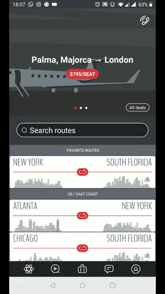
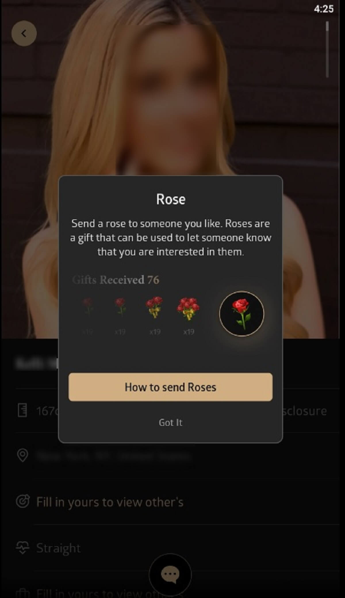
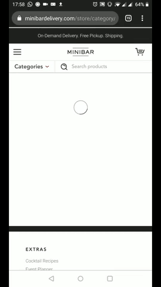

# 3.2 Best Practices

Look & feel is een erg belangrijk onderdeel van het ontwerp van het prototype, omdat het belangrijk is dat de doelgroep een gevoel van meerwaarde krijgt van Go In Chi. Immers past een luxueuze uitstraling van de applicatie bij de welvarende leefstijl van de Pontsteiger bewoners. Daarom ben ik op zoek gegaan naar bestaande apps die voor een luxueuze uitstraling staan.

### Jetsmarter

Jetsmarter is een app waar de luxe echt vanaf spat. Als je dat niet uit het design haalt, helpen de prijzen dat wel duidelijk maken. Vluchten binnen Europa gaan vanaf ongeveer €10.000. Jetsmarter is een privé jet luchtvaart maatschappij die zijn gebruikers privé jets laat boeken wanneer hen dat uitkomt. Op deze manier hoeven de rijke geen gebruik te maken van de normale vliegtuigen en luchthavens, wat voor hen tijd scheelt.

Wat geeft Jetsmarter nou precies de luxe uitstraling? Ten eerste, de service die wordt aangeboden. Door speciaal voor de klant een heel vliegtuig te laten opstijgen, precies wanneer het hem of haar uitkomt, is vanzelfsprekend verantwoordelijk voor een luxueus gevoel\(WDD, 2018\).

In het design zelf is het de combinatie van de typografie, het kleurgebruik en de mooie foto's die verantwoordelijk zijn voor de welvarende uitstraling. Voor de titels wordt een dun, langwerpig schreefloos font gehanteerd. Dit font zorgt voor het luxe gevoel waar Jetstart naar streeft.

### Luxy

Luxy is een vergelijkbare dating app als Tinder, maar dan voor miljonairs. Er zijn twee manieren om je account geactiveerd te krijgen. De eerste manier is door te betalen. Voor maar liefst 80 euro per maand kun je gelijk meedoen. Je kan er ook voor kiezen om niet te betalen. Dan zal het team van Luxy onderzoek naar de klant doen om te kijken of hij of zij waardig genoeg is voor de app. 

Het meest opvallende bij Luxy is zonder twijfel de kleur. Het zwart/wit/goud is  het meest bekende kleurpallet voor een luxe app. Door deze kleurencombinatie te gebruiken, krijgt men  het gevoel dat dit niet zomaar een Tinder alternatief is, maar een exclusieve luxe variant\(Tsykevitch, 2017\).

### Minibar

Minibar is een app waarmee je op elk moment drank thuis kan laten bezorgen. Ideaal na een lange dag waarop je zelf geen tijd hebt gehad om langs de winkel te gaan. De drank die door Minibar wordt aangeboden is niet het soort die je bij de Albert Heijn terug zal vinden, maar eerder in een vijf sterren restaurant.

Qua design schreeuwt Minibar in mijn ogen niet zoveel luxe als Jetsmarter en Luxy dat doen, maar als je kijkt naar de werking van de applicatie wordt de luxe al duidelijker. Uitstekende UX is namelijk ook erg belangrijk om een luxe gevoel uit te stralen\(Adoriasoft, 2018\). Je app kan nog zo goud of zwart zijn als je wilt, maar als de werking op één of ander manier niet goed werkt, val je door de mand. Minibar doet dit wel goed. De app zit vol met herkenbare patterns, waardoor de gebruiker het vrijwel automatisch weet te doorlopen, zonder dat hij of zij de app ooit eerder gebruikt hoeft te hebben.

Er zijn een hoop verschillende apps gericht op de luxe markt. Uit een aantal daarvan vallen wijze lessen te leren, zoals in de voorbeelden die ik heb gegeven. Met name de opvallende delen, met betrekkelijk op vormgeving, ben ik van plan mee te nemen in mijn volgende prototype. 


Onderzoeksvraag: Er zijn een aantal dingen die vaak terug komen bij luxe apps. Het gebruik van bepaald typografie \(lange, dunne en soms fonts met schreef\) en bepaalde kleurencombinaties \(zwart/wit/goud\) komen vaak terug en zijn daarom herkenbaar als luxe. Behalve dat is het ook erg belangrijk dat gebruikers veilloos door de app heen gaan en snel hun doel bereikt hebben.


