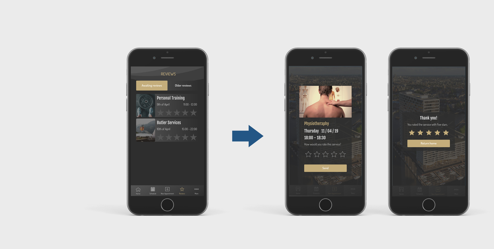
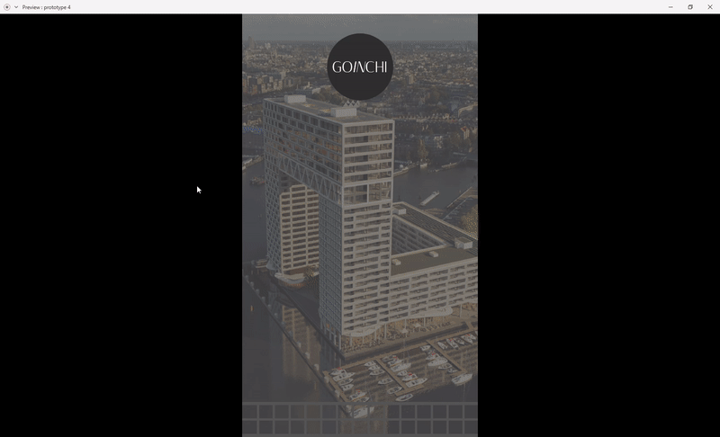
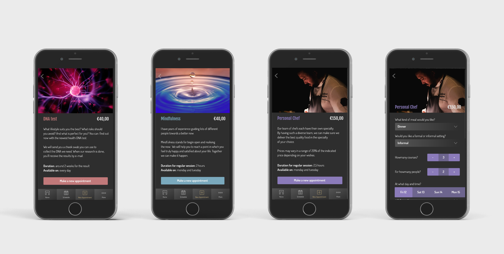
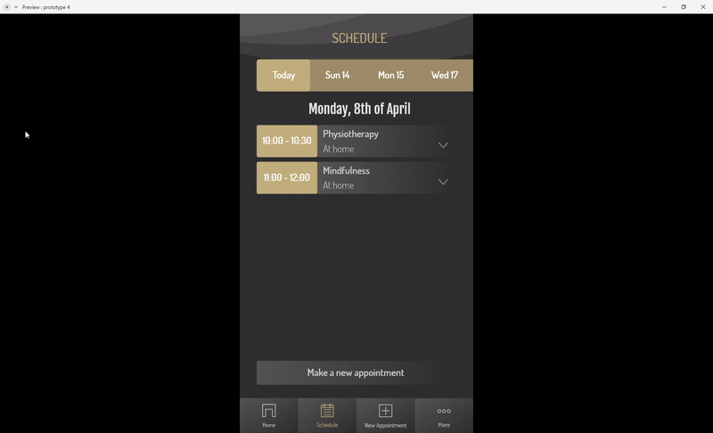
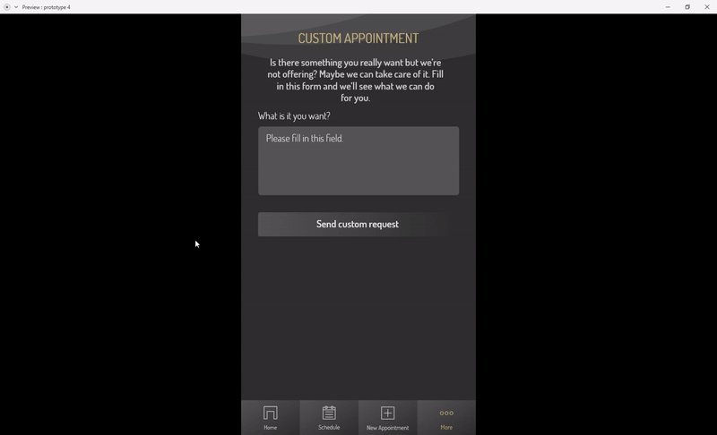
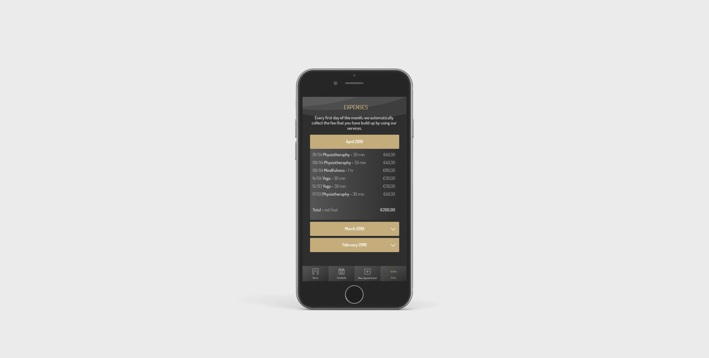
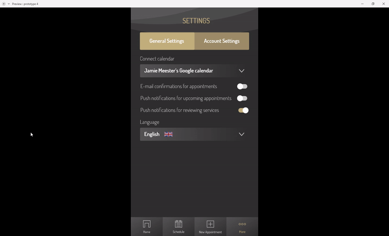

# 3.7 Hi-Fi Prototype aanpassingen

Na de laatste prototype test ben ik tenslotte verder gaan werken om het prototype uit te breiden en te perfectioneren. Mijn prototype was tot nu toe gebouwd om één bepaalde test te doorlopen. Ik wilde nu de andere nodige pagina's ook toevoegen om te laten zien hoe ik vind dat andere schermen eruit zouden moeten zien en zouden moeten werken. Ook wilde ik nog andere onderdelen van Go In Chi testen, wat niet mogelijk was met het vorige prototype.

### Aanpassingen

#### Reviews weg uit het menu

In het vorige design stonden reviews los in het menu. Echter heeft de doelgroep aangegeven dat dit niet de meest motiverende manier is om reviews door te geven. In plaats van een item in het menu te gebruiken is het naar mijn mening daarom beter om na een afspraak een pop-up bericht te gebruiken die gebruikers , die er geen interesse in hebben, ook over te kunnen slaan\(Sparklin, 2018\).

#### Een nieuw filter voor afbeeldingen

Afbeeldingen hadden een simpel donker filter over de foto heen om zo nog steeds tekst eroverheen te kunnen lezen. Dit filter zorgde er echter ook voor dat de afbeeldingen een wat stoffige indruk gaven. Dit heb ik opgelost door een nieuw filter toe te voegen, dat wat meer contrast aan afbeeldingen toevoegt dan het vorige deed.

#### On Your Schedule

De titel boven het stukje dat doorlinkt naar de agenda is veranderd van "On the schedule" naar "On your schedule" om verwarring te voorkomen. Ook is de eerste afspraak van fysiotherapie veranderd, omdat gebruikers op zoek waren naar deze service maar niet wisten dat deze al toegevoegd was aan de agenda, vanwege het feit dat ze dat niet zelf hadden gedaan.

### Toevoegingen

#### Splash Screen met ontgrendeling

Het begin van het prototype heeft nu een splash screen met ontgrendeling doormiddel van een vingerafdruk of wachtwoord. Deze komen in beeld wanneer de app wordt geopend.

De laadbalk onder in beeld is een referentie naar een patroon dat in het Pontsteiger gebouw terug komt. 

#### Meer services

Behalve fysiotherapie zijn er nu ook pagina's in het prototype voor de DNA test, mindfulness en personal chef. Deze services zijn gekozen omdat deze andere benodigdheden hebben dan de fysiotherapie heeft. Bij fysiotherapie en mindfulness heb ik direct contact gehad met de afnemers, dus voor die pagina's kon ik de inhoud op hun advies indelen. Voor de DNA test en personal chef kon ik dat niet, dus hiervoor heb ik online rondgekeken. De DNA test krijgen gebruikers binnen per post, dus de datum die men kiest is eigenlijk de bezorgdatum van Post NL. De personal chef was wat lastiger, omdat de vragen wat ingewikkelder zijn. Go In Chi heeft nog geen connectie met een afnemer voor deze service. Daarom heb ik zelf geprobeerd contact op te nemen met een twee partijen. Helaas heb ik hier geen reactie op gekregen, dus heb ik gekeken naar een aantal personal chefs en daarop mijn keuzes gebaseerd.

#### Item verwijderen in agenda

De agenda geeft nu de mogelijkheid om de fysiotherapie afspraak van maandag 8 April te verwijderen. Voorheen was dit een statische pagina, maar nu kan er wel op geklikt worden. Wanneer de gebruiker besluit een afspraak te annuleren, zal deze uit beeld animeren om aan te geven dat deze wordt verwijderd.

#### More: Custom Appointment

Onder ''more'' staan drie pagina's, waaronder "Custom Appointment". Op deze pagina kan de gebruiker een bericht versturen naar Go In Chi, om een persoonlijke wens te doen. De verstuur knop licht pas op zodra er iets in het tekstveld is gezet. Wanneer de gebruiker het bericht verstuurt, verschijnt er een envelop die weg animeert om aan te geven dat het bericht wordt verzonden.

#### More: Expenses

Mijn opdrachtgever is er nog niet over uit  hoe hij wil dat betalingen voor Go In Chi werken. Het zou een maandelijks abonnement kunnen worden, maar het zou ook gratis kunnen zijn. De prijzen bij de services die ik heb neergezet kunnen daarom ook niet overeen komen met hoe het uiteindelijk zal worden. Op de "Expenses" pagina zal de gebruiken zijn gemaakte kosten kunnen terug zien. De indeling is een metafoor naar een kassabon die wordt uitgevouwen.

#### More: Settings

In het instellingen scherm heb ik de opties verdeeld in twee categorieën: general settings en account settings. Onder account komen alle persoonlijke gegevens terug, zoals de gebruikers e-mail adres en telefoonnummer. Hier kunnen deze ook worden aangepast. Onder general vallen de andere opties die met de app te maken hebben, zoals de taal naar voorkeur of het verbinden van een andere agenda.

Met de toevoeging van de nieuwe schermen zal ik een hoop nieuwe onderdelen uit mijn app kunnen testen. Het prototype telt uiteindelijk 111 schermen. Ik wil testen hoe gebruikers handelen als ze meerdere services moeten boeken. Maken ze gebruik van de shortcuts op de home pagina? En lukt het gebruikers om een afspraak te cancelen?



