# 3.5 Micro interacties

Micro interacties hebben de afgelopen jaren het verschil gemaakt met het design van goed werkende apps en websites\(Tuk, 2016\). Als je terug kijkt naar oudere apps waar micro interacties nog geen ding waren is het veel moeilijker om te volgen wat er allemaal precies gebeurt. Micro interacties kunnen de gebruiker helpen om beter te begrijpen hoe de app of website navigeert, maar is tegelijkertijd ook een aanmoediging om met de site of app te interacteren\(Batchu, 2018\). Behalve dat laat het zien dat er aandacht voor detail was bij het maken van het ontwerp, wat van belang is op de luxe markt\(Batchu, 2018\).

### Swipe

Een vorm van micro interacties die men vaak tegen komt is de swipe. Dit zou kunnen komen, omdat de content die geswiped wordt vaak precies doet wat de swipe hem beveelt. Kinderen die nu opgroeien kunnen nog eerder swipen dan met blokken spelen\(Ratcliffe, 2017\).

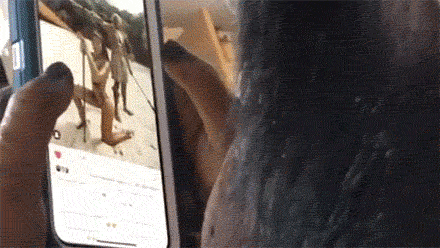

Conclusie, iedereen kan het en weet hoe het werkt. Daarom is dit naar mijn mening één van de meest effectieve micro interacties.

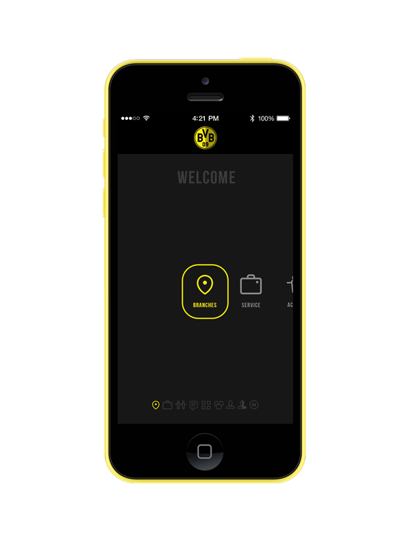

### Uitwerking

Binnen mijn ontwerp van Go In Chi zie ik twee mogelijkheden om de swipe te inplementeren, namelijk voor datums en een carrousel.

#### Datums

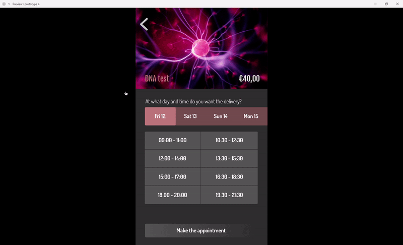

Bij het kiezen van datums worden sliders gebruikt. Deze kunnen met de swipe van positie veranderd worden. Zo heeft de heeft de gebruiker een duidelijk overzicht aan datums maar neemt het niet zoveel ruimte in als bijvoorbeeld een kalender.

#### Carrousel

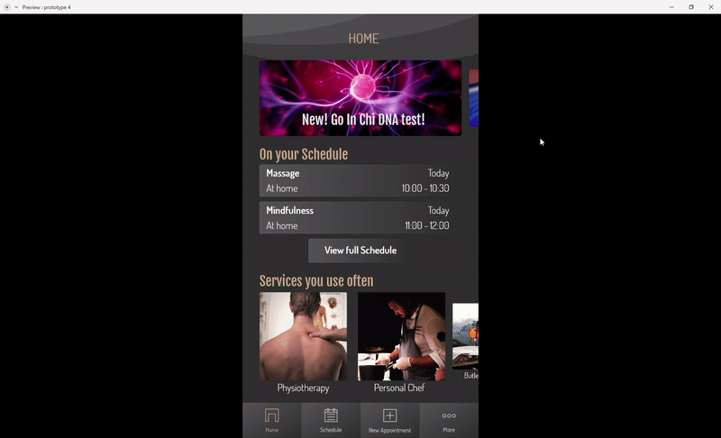

Op het home scherm heb ik twee verschillende carrousels geplaatst. De bovenste is voor nieuwsberichten die in Go In Chi komen te staan. Bijvoorbeeld wanneer er een nieuwe service word toegevoegd. De onderste is een selectie van de services die gebruikers het meest hebben gebruikt. Dit bied ze een snellere toegang dan de normale manier om een afspraak te maken.

### Data input

Een frustrerend onderdeel van het maken van een afspraak kan zijn als het niet in één keer goed gaat. Als er dan ook nog een vage, onduidelijke foutmelding staat ben je er, als gebruiker, snel klaar mee. Gelukkig hebben we micro interacties die kunnen helpen dit makkelijker te maken.

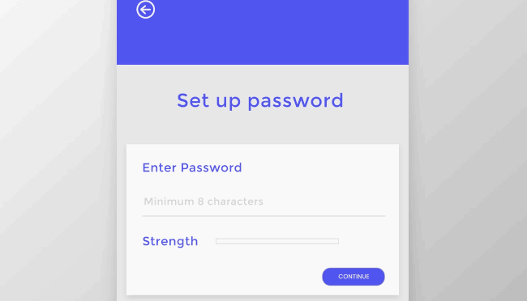

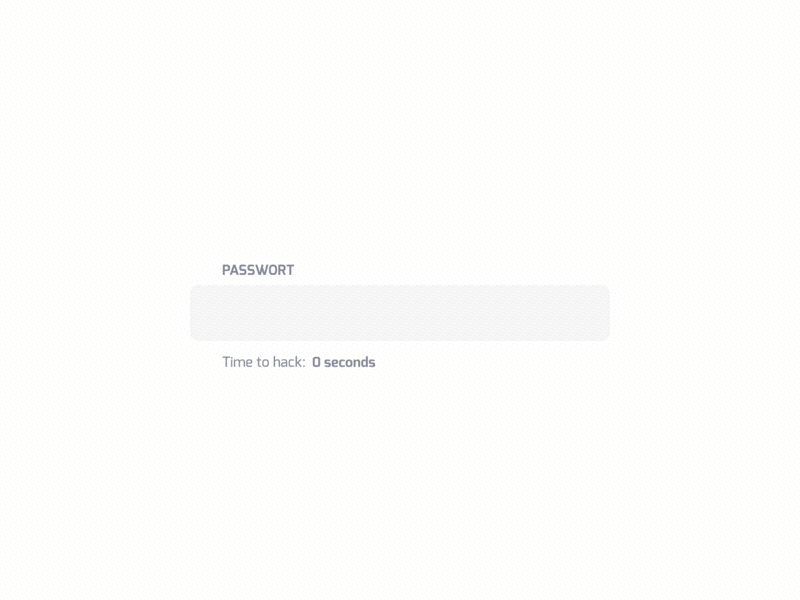

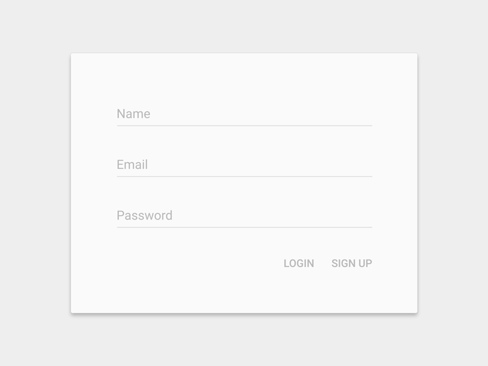

### Uitwerking

Binnen mijn ontwerp van Go In Chi zie ik weer twee mogelijkheden om bij data input een micro interactie plaats te laten vinden. Bij het invoeren van de PIN en bij het invullen van een verplicht veld.

#### PIN invoeren

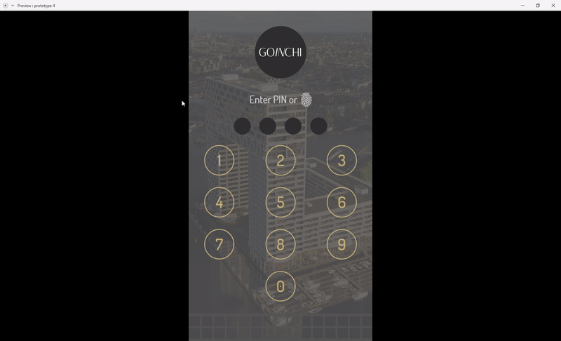

Wanneer een gebruiker zijn PIN code moet invoert en de eerste knop heeft gedrukt verschijnt er naast de 0 een nieuwe optie: reset. Doordat deze later pas in beeld verschijnt zien gebruikers beter waar de knop zit voor als en ze een fout in de code maken.

#### Verplicht invul veld

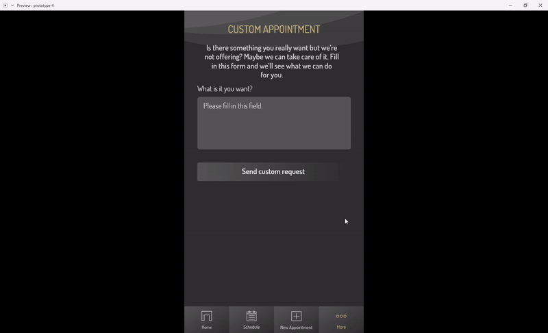

Bij velden die verplicht zijn om in te vullen licht de bevestig knop pas op wanneer de velden die ingevuld moeten worden inhoud hebben. Dit maakt voor de gebruiker duidelijk dat deze knop nu ingedrukt kan worden.

### Animatie

Animaties zijn goed in het wegnemen van de twijfel hoe bepaalde onderdelen werken binnen een app. Een gevaar dat men loopt met animaties is dat de designer er teveel van gebruikt en daardoor gebruikers teveel worden afgeleidt\(Batchu, 2018\). Naar mijns inziens zijn animaties goed om duidelijk te maken wat ergens mee gebeurt en om een gevoel van richting te geven binnen de app.

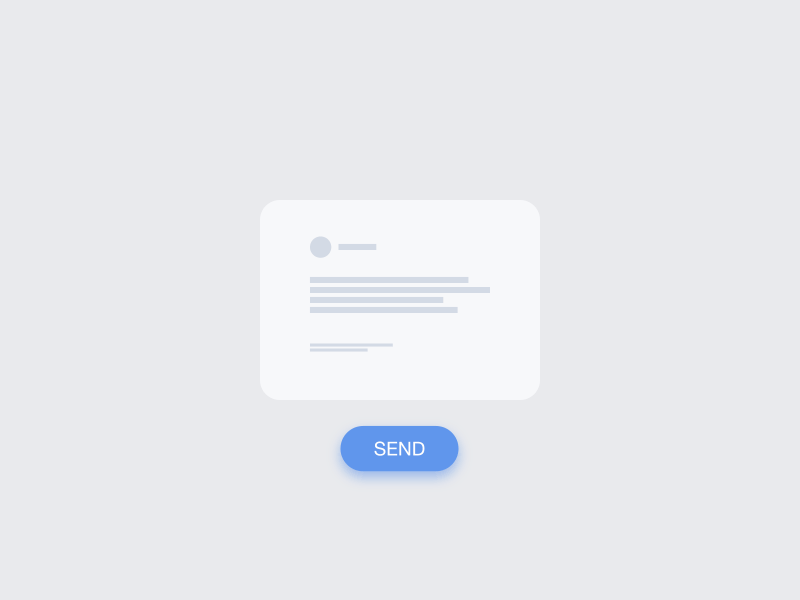

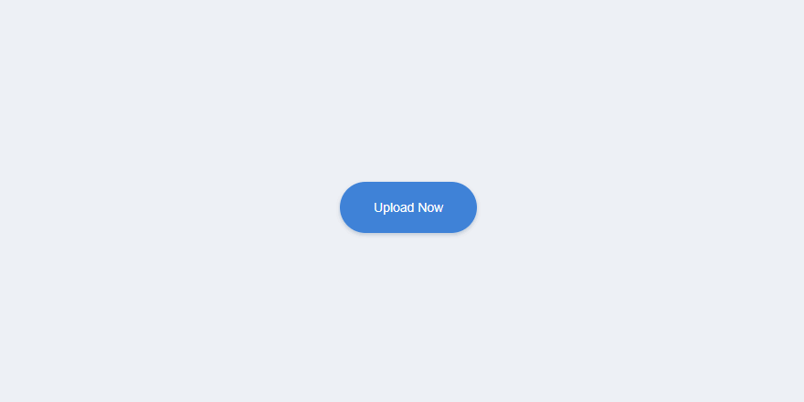

### Uitwerking

Animaties kunnen op veel plekken geplaatst worden voor meer duidelijk. In Go In Chi heb ik vier verschillende plekken gevonden waar dit mij van toepassing leek. Dit zijn de splash screen,  het kiezen van een service, een afspraak cancelen en een bericht versturen.

#### Splash Screen

Tijdens het laden van de pagina zal er een laadbalk te zien zijn. Hierdoor weten de gebruikers dat de applicatie bezig is met het verwerken van zijn of haar selectie.

 Deze laadbalk heb ik gebasseerd op een vorm uit de Pontsteiger.

#### Services kiezen

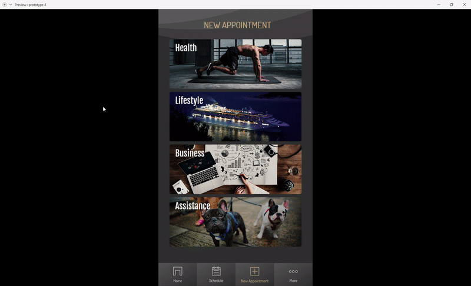

Wanneer de gebruiker een service kiest, word deze doormiddel van een animatie vanuit rechts geopent. Deze animatie suggereert dat er iets opengemaakt word zodat gebruikers hun oriëntatie niet verliezen.

#### Afspraak maken

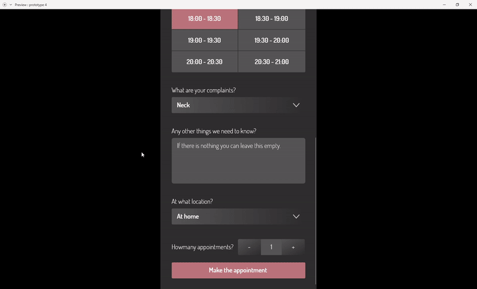

Nadat de gebruiker een afspraak heeft gemaakt, zal deze richting de agenda animeren om aan te geven dat de afspraak hier aan is toegevoegd.

#### Afspraak Cancelen

Wanneer een gebruiker besluit een afspraak te cancelen, zal deze uit beeld animeren. Dit laat duidelijk zien dat deze afspraak ook echt helemaal is verwijderd en niet meer op de planning staat.

#### Bericht versturen

Wanneer de gebruiker via "Custom Appointment" een bericht verstuurd, verschijnt er een korte animatie waarin het bericht in een evelop word gestopt en uit beeld word gestuurd. Na de animatie verschijnt er nog een bericht in beeld om mede te delen dat het bericht succesvol is verzonden.

Micro interacties kunnen op veel onderdelen van toepassing zijn. Ik heb gekeken waar ik denk dat deze binnen Go In Chi het beste kunnen helpen


Onderzoeksvraag: Micro interacties kunnen voor gebruikers een hoop dingen duidelijk maken. Als bijvoorbeeld een afspraak gemaakt word en de gebruiker deze na afloop richting de agenda ziet animeren geeft dit nog extra duidelijkheid dat het dus is gelukt om de afspraak toe te voegen.


