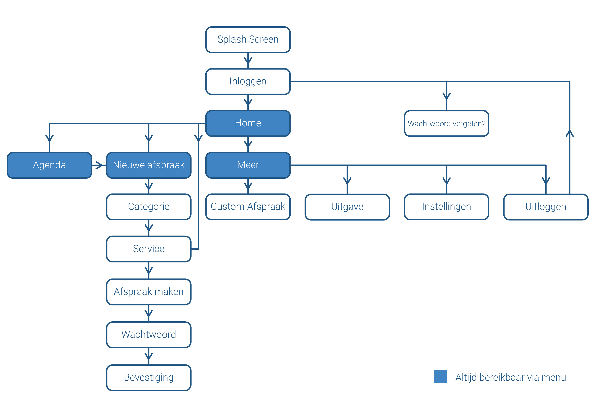

# 3.1 User Flow

Om duidelijk in beeld te krijgen welke schermen precies in de app verwerkt zijn, heb ik een flowchart gemaakt. Dit is voor mij persoonlijk handig omdat ik het als het ware als checklist kan gebruiken bij het maken van het volgende prototype. Deze zal weer aanzienlijk anders worden dan het vorige, vanwege de feedback die ik erop gekregen heb, tijdens de feedback frenzy en de prototype tests bij de doelgroep.

De blauwe blokken zijn de pagina's die altijd via het menu direct bereikbaar zijn. Hier kan de gebruiker dus op elk moment naar terug komen. De belangrijkste uitkomst is eigenlijk het maken van een afspraak. Dit is dus de flow die ik het liefst wil dat gebruikers doorlopen. Omdat de meeste flows vanuit de home pagina naar het maken van een afspraak leiden, zullen gebruikers hier vaak in terecht komen. 


Onderzoeksvraag: Het liefst zie ik dat gebruikers probleemloos afspraken kunnen maken. Daarom heb ik de flow redelijk simpel gehouden, met altijd de optie om naar het "Nieuwe afspraak" scherm terug te keren. Ook is op home een versnelling naar sommige services te vinden wat gebruikers aanspoort om hier gebruik van te maken.


